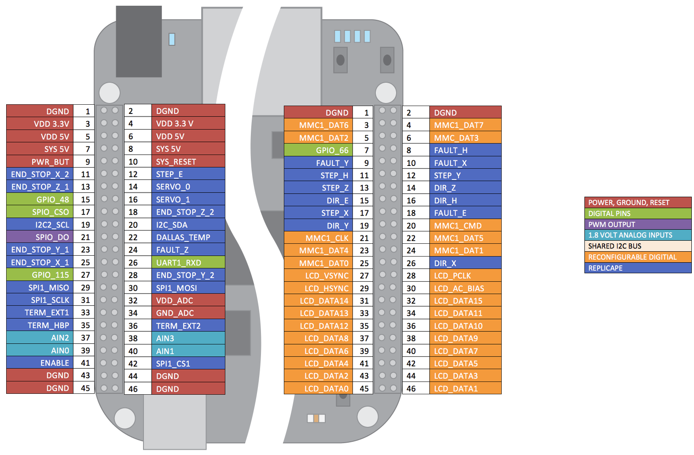

Replicape Development
=====================

.. role:: todo

If you want to extend, build or modify Replicape, for the repository:
https://github.com/intelligent-agent/replicape

Routing and noise
-----------------

The Rev B PCB is a four layer PCB. The top layer is mostly vertical
traces and the bottom layer is mostly horizontal. The uppermost inner
layer is a ground layer with no signal traces. The lower inner layer
is the voltage plane layer. There are in total 4 voltage planes:
12..24V, 12V, 5V and 1.8V. In addition, there is a 3.3 V trace routed.

Component placement
-------------------

All components are placed on the top layer to reduce cost of
manufacturing. There are two fiducials on the top side to aid in pick
and place placement of components.

Board extensions
----------------

Revision B does not have a dedicated extension header like the one
that was introduced in rev A4A. There should still be possible to add
an extension board on top of the current version that can add up to
three more extruders. This is being developed.

BeagleBone Connections
----------------------

Below is a diagram of the pins that have been used on the BeagleBone.

Thermistor Inputs
-----------------

The thermistor inputs have a first order low pass filter with a cut
off frequency of 3.4 Hz. Since only slow moving signals are measured,
this cuts out all capacitive influence from the high power heater
cables that typically run in parallel with the thermistor cables.

Power Management
----------------

Replicape has two step down voltage regulators or 5V and 12V, both
built using Richtec RT8268GFP.

.. _EEPromFlash:

Update EEPROM
-------------

The EEPROM on the Replicape should be updated when it arrives. If not, here are the instructions on how to update it on Debian

::

    sudo -s
    wget https://github.com/intelligent-agent/replicape/raw/bf08295bbb5e98ce6bff60097fe9b78d96002654/eeprom/Replicape_00B3.eeprom
    cat Replicape_00B3.eeprom > /sys/bus/i2c/drivers/at24/2-0054/at24-1/nvmem
    exit
