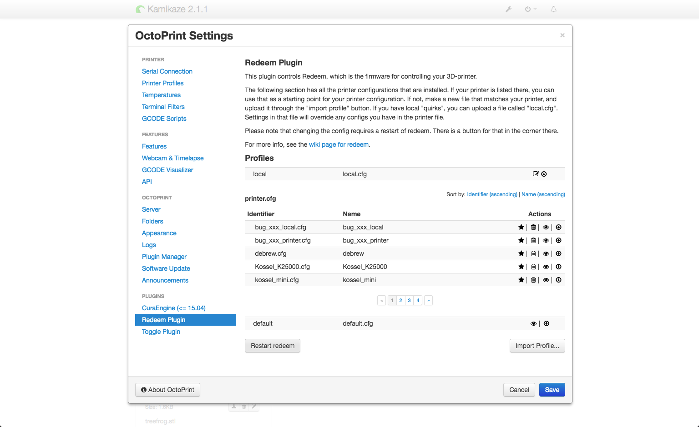

Initial Configuration
=====================

..  role:: todo

Calibrating Redeem for your 3D printer's hardware.

There are three levels of configuration files:

=============== =========================================================================
``default.cfg`` defines all of the parameters. this should not be modified.
``printer.cfg`` references a standard set of configuration for specific types of printers
``local.cfg``   any additional changes needed for your local setup
=============== =========================================================================

Any settings defined in ``local.cfg`` overrides the values in ``printer.cfg`` and ``default.cfg``.

Any settings defined in ``printer.cfg`` take precedence over ``default.cfg``.

Currently, Replicape ships with printer configuration files for:

- Kossel K250000
- Kossel Mini
- Makerbot Cupcake
- Max Core XY
- Mendel Max
- Prusa i3
- Prusa i3 quad
- Rostock Max v2
- Thing
- Thing Delta
- Ultimaker Original

To select the printer configuration, go to the Configuration section of Octoprint and click on the Reedem section.

Of the printers listed, clicking the star activates it as the printer configuration. Upon first install, the ``local.cfg`` file is blank but from this same screen you can upload you're own file.

For more information on various settings, check out the full :doc:`/replicape/configuration` guide.

..  note:: If you have a printer not listed, you can create your own ``printer.cfg`` and :doc:`contribute it to the project </development/index>`.
