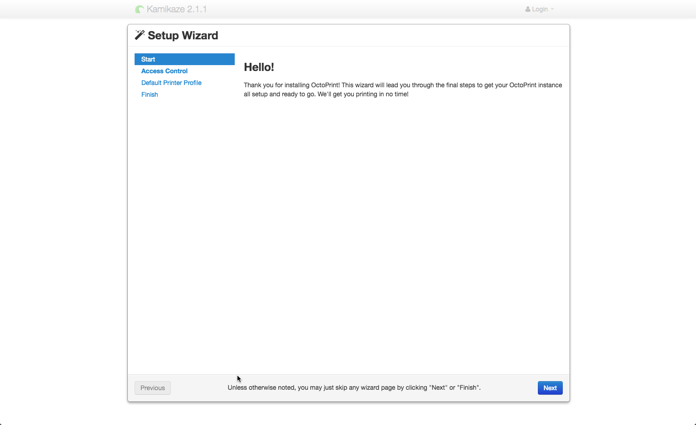

Connecting
==========

Browser
-------

Umikaze uses Octoprint for interacting with the Replicape and your 3D printer.

To access, go to `http://kamikaze.local`__.

__ http://kamikaze.local

If you cannot connect, read the section on :doc:`/support/howto/linklocal`.

Once you connect to the OctoPrint interface, you will need to step
through setup the first time. As you step through the setup:

-  Set a username and password for OctoPrint
-  It's recommended that you keep Access Control Enabled for security reasons.
-  Set your print bed dimensions
-  Axis speeds can be left at the defaults, as they only control the manual movements that you make through OctoPrint.

Terminal
--------

Sometimes it is necessary to make changes to the configurations directly
or to debug a broken config file without going through the OctoPrint browser
interface. For those unfamiliar with working with a linux operating system,
check out our :doc:`/support/howto/beginlinux`.

Connecting via Network
~~~~~~~~~~~~~~~~~~~~~~

For the standard Beaglebone Black connected via ethernet.

::

    ssh root@kamikaze.local

Connecting via USB
~~~~~~~~~~~~~~~~~~

For BeagleBone Black Wireless, network access isn't yet established.

To determine the device's name once attached look at the output of `ls -al /dev/cu.usbmodem*` before and then
after you connect your host computer to the device. Next attach to the serial console:

::

    screen /dev/cu.usbmodem<number> 115200

Access Control
--------------

There are two user accounts that have admin permissions:

- username: ``root``, password: ``kamikaze``
- username: ``ubuntu``, password: ``temppwd``

..  danger::
    If you are not on a secure or private network, it is highly recommended
    to :ref:`change the password <ChangePassword>` for both accounts. Someone
    accessing your device can intentionally (or unintentionally) damage your
    3D printer.

..  note::

    These user passwords are completely separated from the
    octoprint users you setup during the setup wizard for access control.
