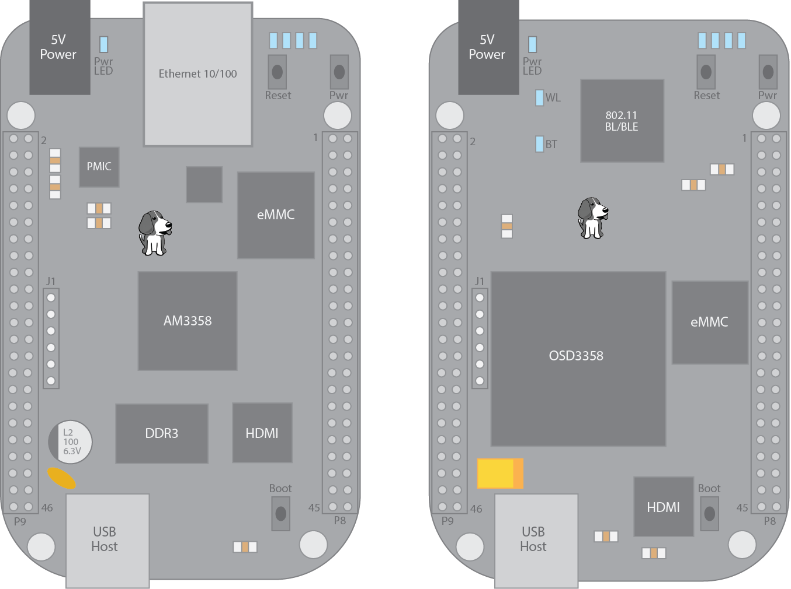

Software Installation
=====================

.. role:: todo

While the Redeem firmware can be installed on any BeagleBone Black compliant operating
system, the Umikaze image (formerly Kamikaze) contains a ubuntu-based operating
system with all the necessary packages and configuration included.

To download the latest release, go to the `Umikaze release`__ page.

__ https://github.com/intelligent-agent/Umikaze2/releases

Installation
------------

Once you have downloaded the latest release, you will need to extract it on to a microSD card.

If you need help with this, check out :doc:`/support/howto/imageburn`.

Next, insert the microSD card into the BeagleBone Black, hold down the boot button and apply power.

After 10-15 seconds, there will be 4 blue lights on the BeagleBone Black that will
will flash in a `Kight Rider`__ pattern. The flashing procedure will take about
15 minutes and the board will power down.

__ https://giphy.com/gifs/80s-nbc-knight-rider-Bo2WsocASVBm0

Once complete, remove power, eject the SDcard and re-apply power.

The first time the BBB boots up after removing the SD card, it will run a script to
compile the device tree overlays into the kernel and then it will reboot.

..  important::

    Test that your installation was successful by ``ping kamikaze.local``.
    If this does not work, check out the :doc:`/support/howto/linklocal` guide or
    see our :doc:`/support/troubleshooting` guide.

Running from SD card
--------------------

If you want to run the image from the SD card and not overwrite the on
board flash, you need to place the SD card in a computer running Linux
(Windows and MacOS cannot read the card as yet) and edit the file on the
SD card with the path ``/boot/uEnv.txt`` from the partition called Umikaze.
Comment out the last line of the file with a #, the line that starts the
flasher instead of systemd.

