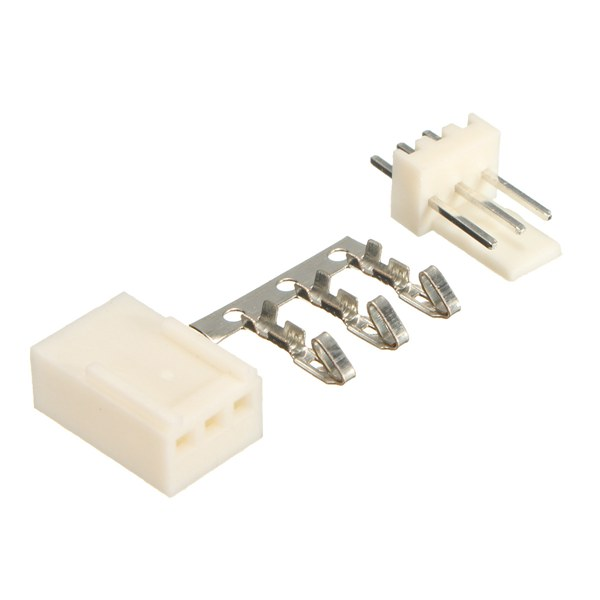

Wiring
======

Screw Terminal Connectors
-------------------------

The Molex screw terminals are included when purchasing Replicape for the  power in, hot ends and heat bed connections.

Pin Connectors
--------------

The remaining connectors have the standard 0.100" (2.54mm) separation distance between pins.

There are many varieties that are compatible, each coming in a range of pin configurations; two common ones:

**KF2510**

Assortment sets can be purchased on `amazon`__ or any number of `other retailers`__.

The connectors can also be purchased individually from places like digikey in
the `2 pin`__, `3 pin`__ and `4 pin`__ varieties that are needed.

__ http://a.co/9ciLxms

__ https://www.google.com/search?q=KF2510+kit

__ https://www.digikey.com/short/qchnth

__ https://www.digikey.com/short/qchntb

__ https://www.digikey.com/short/qchntf

**Dupont**

Assortment sets can be purchased `amazon`__ or many `other retailers`__.

Or be purchased individually in `2 pin`__, `3 pin`__ and `4 pin`__ varieties.

__ https://www.amazon.com/GeeBat-Connector-Assortment-Connectors-Terminals/dp/B01M7V1X88

__ https://www.google.com/search?q=dupont+connector+ebay

__ https://www.digikey.com/short/qchwvd

__ https://www.digikey.com/short/qchwvv

__ https://www.digikey.com/short/qchw1t

.. note:: dupont connectors are non-polarized connectors so care should be taken when connecting to the replicape

Power In
--------

The power connector has two positive inputs and two negative, in order to safely carry up to 20 amps from the power supply.

Steppers
--------

Bipolar stepper motors typically have four wires: two for each of the coils. These can be labeled in various ways:

================== =================
Coil 1             Coil 2
================== =================
A1, A2             B1, B2
:math:`A, \bar{A}` :math:`B, \bar{B}`
black, green       red, blue
================== =================

Unipolar stepper motors have an extra, mid-coil lead. For this application, these can be left disconnected.

Fan
---

Each fan connector is polarized with a positive and negative.

Cold End
--------

Low temperature sensors, such as the DS18B20, are typically used for monitoring the cold end of the extruder.

Thermistor
----------

The thermistors are non-polarized.

End Stop
--------

Each end stop requires a ground (black) and 5V (red) connection as
well as the signal (yellow) for the Replicape to monitor.

Inductive Sensor
----------------

Inductive sensors require ground (black), a 5V supply (red), a 12V supply (orange)
and the signal (yellow) for the replicape to monitor.

Hot Ends
--------

While there is a positive and negative pin for each, the ``heater e``
and ``heater h`` are resistive loads and polarity does not matter.

Heatbed
-------

Since the hotbed is also a resistive load, polarity does not matter.

Similar to the power in connector, there are double connections
to safely carry the current needed for the hotbed.

For more detailed information, please see Replicape's :doc:`/replicape/techspecs`.