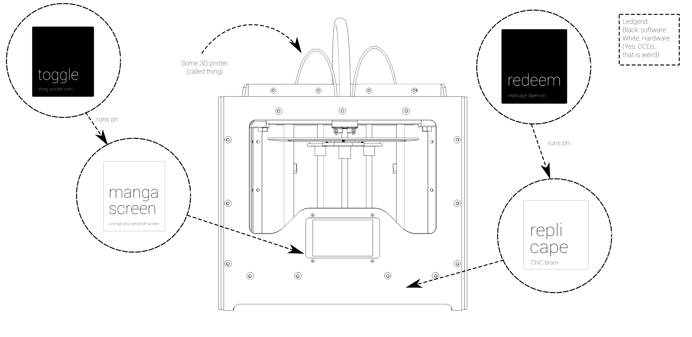

=============
Thing Printer
=============

A development platform for electronics and software made by Intelligent Agent. All software is
free and open source. The hardware is also open source, but can be conveniently purchased in the store.

Documentation on installation: :doc:`/kamikaze`.

Documentation on controller hardware: :doc:`/replicape`.

Documentation on controller software: :doc:`/redeem`.

Documentation on display: :doc:`/magnascreen`.

Documentation on display software: :doc:`/toggle`.

..  toctree::
    :maxdepth: 4
    :hidden:

    ./kamikaze.rst
    ./replicape.rst
    ./redeem.rst
    ./magnascreen.rst
    ./toggle.rst

..    ./gettingstarted/index.rst
..    ./replicape/index.rst
..    ./umikaze/index.rst
..    ./magnascreen/index.rst
..    ./development/index.rst
..    ./support/index.rst
..    ./attribution.rst

