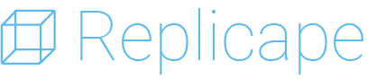
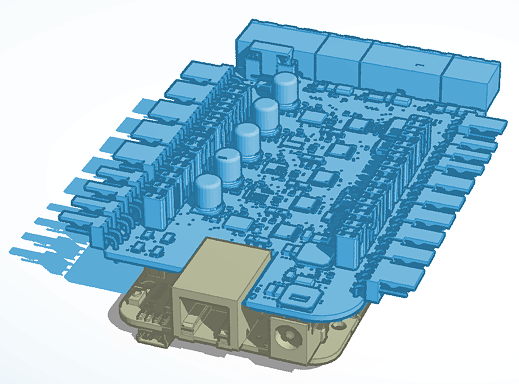

Hardware and software to control 3D printers and CNC machines, such as routers, lathes and mills.

Features
--------

The Replicape is **blazing fast**. It runs on with a BeagleBone Black, with a 1GHz CPU and two 200MHz PRUs.

The Replicape is **extremely versatile**. Control up to five 2 amp stepper motors, two servos and four fans.

The Replicape is **stealthly silent**. Uses industry leading TMC 2100 stepper motor drivers, which have incredible low noise.

The Replicape is **smart and connected**. Interact with your printer via browser while simultaneously printing.

Documentation
-------------

Looking to purchase? You can find the Replicape from `ThingPrinter`__ or at `Seeed Studio`__.

__ https://www.thing-printer.com/product/replicape/

__ https://www.seeedstudio.com/Replicape-Rev-B-3D-printer-controller-board-p-2942.html

Once you've purchased your Replicape and Beaglebone Black, you're ready to get started! Check out the :doc:`/gettingstarted/index` guide.

Ecosystem Terminology
---------------------

There are several different projects that contribute to this platform.

**Replicape** the hardware add-on to a BeagleBone Black that controls 3D printers and CNC machines

**Redeem** the software that communicates with the replicape and converts g-codes into motion

**Umikaze** the BeagleBone Black operating system which includes everything necessary for operation, based on Ubuntu

**Kamikaze** the predecessor to Umikaze, based on Debian

**MagnaScreen** a compact, high-definition touch screen

**Toggle** software to build interactive applications with MagnaScreen

..  toctree::
    :maxdepth: 5
    :hidden:

    ./gettingstarted/index.rst
    ./replicape/index.rst
    ./development/index.rst
    ./support/index.rst
    ./attribution.rst

