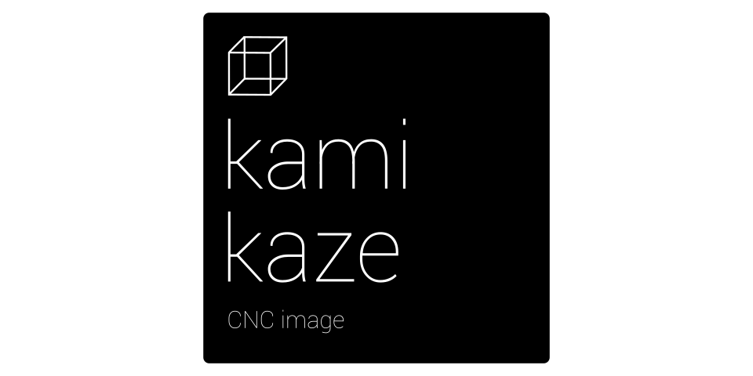
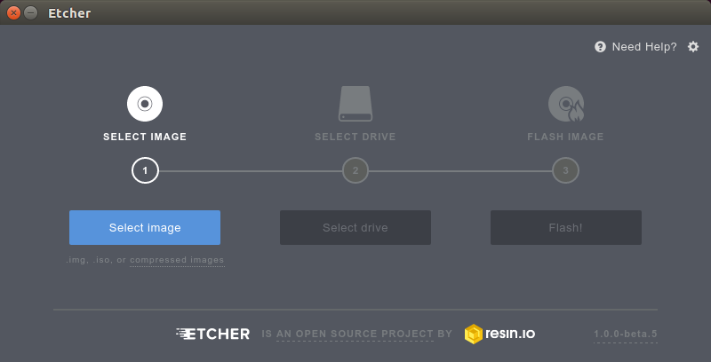

Kamikaze
========

..  contents:: Table of Contents
    :depth: 2
    :local:

..  toctree::
    :numbered:

Kamikaze 2.1 is a complete Linux distribution based on Ubuntu 16.04.1 LTS. It has all
the necessary software for running :doc:`/replicape` to control your 3D printer.

The way this works is you download an image file, extract that onto a
mico SD card and place that SD card in your BeagleBone Black. After some
5 minutes of looking at the logo and drinking coffee, the flashing
procedure is over, you remove power from the BeagleBone, eject the SD
card and re-apply power to the board. If you have :doc:`/magnascreen`,
 you should see :doc:`/toggle` appear on the LCD. You should also be able to point your browser to
`http://kamikaze.local <http://kamikaze.local_http://kamikaze.local>`_
which will display a welcome wizard with instructions about how to set
up your Octoprint instance. The rest of the documentation is included in
the :doc:`/redeen` page or below.

Background
----------

Kamikaze 2.1.0 is now available for download. With version 2.1, the
way the image is created has changed. The image is now made starting
from the Ubuntu 16.04.1 LTS release for BeagleBone, and altered to be
great for 3D-printing. Redeem, Toggle and OctoPrint is now installed
by forking the git repository and installing from source. This makes
hacking very easy, and also enables updates to be monitored from
within OctoPrints own software update system. `Kamikaze 2.1.0`__

__ https://github.com/goeland86/Kamikaze2/releases/tag/2.1.0>

The size is 425 MB compressed, but expands to a 1.6 GB partition,
suitable for a 2GB or bigger SD card. The total disk space used by
Kamikaze is 1.3GB - so if you have one of the older rev C BeagleBone
Black with only 2GB eMMC, you should still have plenty of space to
work with.

Username/password
-----------------

For SSH:

::

    root: kamikaze

There is another user existing, which is

::

    ubuntu: temppwd

That is the default user password which can use sudo. If you are not on
a secure and private network, it is highly advised to change the
password for both accounts! Do this by SSH-ing in as the user you want
to change the password of and running the command::

    passwd

Note that these user passwords are completely separated from the
octoprint users you setup during the setup wizard for access control!

Burn image
----------

Once you have the BBB-flasher downloaded to your computer, you can
transfer it to a microSD card (not included) in the normal manner.

Go to `http://www.etcher.io/ <http://www.etcher.io/>`__ and download
the app for your OS.

Linux
~~~~~

For Linux, make sure you make the app executable and start it as root:

::

    cd ~/Downloads
    chmod +x Etcher-linux-x64.AppImage
    sudo ./Etcher-linux-x64.AppImage

Windows
~~~~~~~

It's a normal program installer. Install it and run it.

OS X
~~~~

It's a normal installer, just drag the app into the application folder.

Starting up
-----------

You should see the app appear, similar to this:

Follow the instructions from the app, briefly:

1. Hit “select image” and find the image you previously downloaded called " BBB-eMMC-flasher-kamikaze-YYYY-MM-DD-4gb.img.xz".

1. Insert a 4GB micro SD card in your SD card reader slot. The card should be detected by the app.

3. Hit flash, and wait for it to finish.

I've also made a quick video on how to do this procedure:

..  raw:: html

    <iframe width="560" height="315" src="https://www.youtube.com/embed/23Id20_8hWs" frameborder="0" allowfullscreen></iframe>

Running Kamikaze from SD card
-----------------------------

If you want to run the image from the SD card and not overwrite the on
board flash, you need to place the SD card in a computer running Linux
(Windows and MacOS cannot read the card as yet) and edit the file on the
SD card with the path /boot/uEnv.txt. from the partition called
Kamikaze. Comment out the last line of the file with a #, the line that
starts the flasher instead of systemd.

Flashing procedure
------------------

Once the SD card is inserted in the SD card slot of the BBB, hold down
the “boot” button and apply power. If you have a Manga Screen installed,
the Kamikaze splash screen will appear within 3 seconds. After 10-5
seconds, the 4 lights on the BBB will flash in a “Night rider” pattern
(also called cylon leds). Once the flashing procedure is done, after
about 15 minutes, the board will power down. Remove power, eject the
SDcard and re-apply power. The first time the BBB boots up after
removing the SD card, it will run a script to compile the device tree
overlays into the kernel and then it will reboot.

Troubleshooting
---------------
Make sure:

- The microSD card you are using is 2GB or more.

- All the lights light up at the end of the flashing procedure.

- You remove the card after the flashing procedure is done.

- During the first boot, you leave it powered on for a few minutes. On first boot, some scripts will run, and Octoprint will take a while to start.

- If you're not planning on using USB networking you'll need to setup wifi following the instructions in :ref:`wifi`.

Getting started
---------------

Elias made a quick video to show how to get started with Kamikaze 2.0.8 - it will be updated for Kamikaze 2.1.0:

..  raw:: html

    <iframe width="560" height="315" src="https://www.youtube.com/embed/BKb28fJx26I" frameborder="0" allowfullscreen></iframe>

Ways to connect
---------------

There are several ways to connect your computer to the BeagleBone Black.
If you have a router or switch, simply use a network cable and connect
your BeagleBone to that. The BeagleBone should start to answer pings on
the `link-local`__ address right away:

__ https://en.wikipedia.org/wiki/Link-local_address_link-local

::

    ping kamikaze.local

If you are on a more exotic network, you might have to find your
BeagleBones IP address manually.

Another way is using a USB cable to connect from your computer to the
BeagleBone. The BeagleBone has ethernet over USB that has a static IP
address of 192.168.7.2. You can then log in with ssh::

    ssh root@192.168.7.2

and check your BBBs assigned IP address with ifconfig. Note that if your
computer may recognize the ethernet but not automatically set an IP that
allows it to talk to the BBB - in which case you should setup a manual
IP on that interface with the address 1.92.168.7.1 and netmask
255.255.255.0

**Note for Windows users:** you'll need to install Apple's `bonjour
service <http://bonjour.en.softonic.com/>`__ to autodiscover the BBB on
the network, if your router/modem doesn't do DNS assignment (or if
you're using USB). Furthermore, for ssh on windows, it is recommended to
use `PuTTY <http://www.putty.org/>`__

Quirks
------

The first time Kamikaze boots, the index file for the kernel objects is
recreated and the necessary permissions for Octoprint are run. It can
take a while, please be patient.

If you have Manga Screen and would like to avoid the blinking cursor
screwing up your Toggle, you can disable the cursor from the command
line of BeagleBone. Disable console cursor::

    echo 0 > /sys/class/graphics/fbcon/cursor_blink

Upgrading packages
------------------

Since this is a Debian system, packages can be upgraded with apt.

::

    apt-get update
    apt-get upgrade

Please note that since this also upgrades the SSH daemon, which may kick
the user out during the upgrade process. If that happens, you need to
SSH back in, and continue the process:

::

    dpkg --configure -a

Most users will want to update the latest version of redeem or toggle
periodically.

To update redeem
~~~~~~~~~~~~~~~~

The octoprint\_redeem plugin should provide a prompt when there is a
redeem update available, and the wizard should work in almost all cases.
If it doesn't, or if you prefer knowing the gritty details of how to do
this by hand, here are the manual instructions.

Login as root and execute these commands:

::

    cd /usr/src/redeem
    git pull
    python setup.py clean install
    cp configs/* /etc/redeem
    systemctl restart redeem

To switch to the develop branch
~~~~~~~~~~~~~~~~~~~~~~~~~~~~~~~

If your printer suffers from problems that are being addressed or if you
want to help test the next version of redeem, you need to switch your
installation to the develop branch of Redeem. **Beware: there be bugs
and dragons in this code!**

To do so, follow these instructions:

::

    cd /usr/src
    rm -r redeem
    rm -r /usr/local/lib/python2.7/dist-packages/Redeem*
    git clone https://bitbucket.org/intelligentagent/redeem.git
    cd redeem
    git checkout develop
    python setup.py install
    cp configs/* /etc/redeem
    systemctl restart redeem

To update toggle
~~~~~~~~~~~~~~~~

Just like Redeem's updates, the octoprint\_toggle plugin should provide
a wizard for updating the software. Below are the manual commands for
the geeks, the curious, and those whose automatic updates failed. But
please report it if the failure is consistent!

login as root and execute these commands:

::

    cd /usr/src/toggle
    git pull
    python setup.py clean install
    cp configs/* /etc/toggle
    systemctl restart toggle

..  _wifi:

Wifi
----

Kamikaze 2.1 uses NetworkManager for handling connections, instead of connman.

Basically plug in your wifi dongle, boot (or reboot), connect to the BBB
via USB or Ethernet, login via SSH as root, and run

::

    nmtui

The wizard should be pretty self-explanatory, but reach out to the
community on Google+ or the #support channel on Slack should you need
help.

Webcam
------

Webcam streaming has been tested with Logitech C270. Most of this is from `Setup on BeagleBone Black`__

__ https://github.com/foosel/OctoPrint/wiki/Setup-on-BeagleBone-Black-running-%C3%85ngstr%C3%B6m#webcam

mjpg-streamer is shipped with Kamikaze 2.1 by default. It is on and if you have a webcam plugged in
before powering up, the streams should return video if your webcam is supported.

The stream should be available through http://kamikaze.local:8080/?action=stream

To integrate this in Octoprint::

    nano /home/octo/.octoprint/config.yaml

Add this to the webcam section if octoprint isn't showing the feed
already::

     webcam:
       stream: http://kamikaze.local:8080/?action=stream
       snapshot: http://kamikaze.local:8080/?action=snapshot
       ffmpeg: /usr/bin/ffmpeg

Restart octoprint

System commands
---------------

The wizard for Octoprint has a section asking for server commands. Fill
in these commands for the entries:

::

    Restart octoprint:
    sudo systemctl restart octoprint.service
    Reboot:
    sudo reboot
    Shutdown:
    sudo shutdown -h now

Known problems
--------------

-  Redeem configuration files list is empty on initial boot.

   -  Upload an empty config file to show the pre-defined files from the
      filesystem.
   -  Same applies to Toggle

-  Uploading local.cfg via Octoprint Redeem plugin renders an empty file
   the first time.

   -  Upload the file twice for it to work.

-  The Kamikaze logo does not show up on MangaScreen during eMMC
   flashing. Purely cosmetic.

-  Some modifications of the local.cfg or to a printer's .cfg file
   aren't applied

   -  The workaround is to manually search for and delete two files:: ``firmware_endstops.bin`` and ``firmware_runtime.bin``.

They should be somewhere in /usr/local/lib/python2.7 and you can find them with sudo find \| grep firmware\_runtime in that directory.

.. _ManualInstallationOfPackageFeed:

Manual installation of package feed
-----------------------------------

To manually add the Debian repository with Replicape and Toggle
packages, add this in a shell on your BeagleBone::

     wget -O - http://kamikaze.thing-printer.com/apt/public.gpg | apt-key add -
     echo "deb http://kamikaze.thing-printer.com/apt ./" >> /etc/apt/sources.list
     apt-get update

The Kernel in the current image is the 4.1 LTS branch, and it has PRU support.

Efforts are ongoing to try and use the 4.4 LTS branch for the new Wireless version of the BeagleBoneBlack.

Source files
------------

Kamikaze 2.1.x is a distribution building on top of the wonderful Ubuntu
LTS console distribution for BeagleBone. It is merely adding the
necessary packages and overlays necessary as in 1.x and 2.0.x versions
did on top of Debian. Kamikaze 2 source files are available here: https://github.com/goeland86/Kamikaze2

Attributions
------------

Octoprint is the brainchild of Gina Häußge, license AGPL and hosted
here: http://octoprint.org/

CuraEngine is developed and maintained by Ultimaker and has the AGPL V3
license. See the git repo for details: https://github.com/Ultimaker/CuraEngine
