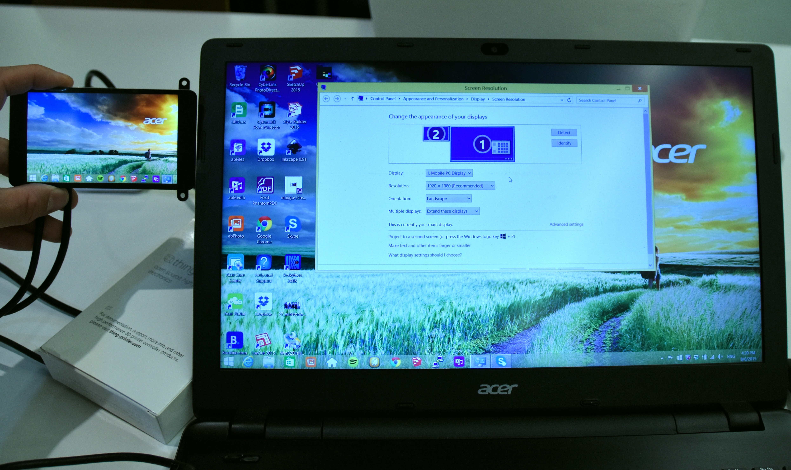

MagnaScreen
===========

..  figure:: ./images/magnascreen_header.png
    :figclass: inline

..  contents:: Table of Contents
    :depth: 2
    :local:

Manga Screen is a 4.3" LCD screen with a capacitive touch panel and an
HDMI input.

If you have a Beaglebone black, a Raspberry Pi or (eventually) an
Arduino Tre or any other embedded or personal computer with a DVI or
HDMI output, you can attach a Manga Screen to it and it will work like a
normal screen.

The resolution is high for such a small screen with 800x480 (WVGA) and
the capacitive touch screen driver used is the fabulous FT6206.

Here is what Rev A3 looks like:

..  figure:: ./images/magnascreen_back.jpg
    :figclass: inline

Where to buy
------------

It's sold out :( There was a Kickstarter campaign in Q1 of 2014. Once
that was delivered a new batch was created. The second batch has also
been sold out, but unfortunately, the LCD has now gone out of
production. Therefore a new revision is under way, bigger and better!

If you have mad skills with a solder iron, you can make one.
For the latest production files, have a look at the repository:
https://bitbucket.org/intelligentagent/manga-screen

HDMI Cables
~~~~~~~~~~~

The HDMI connector on the screen is a type D (micro) https://en.wikipedia.org/wiki/HDMI#Connectors. Raspberry Pi
and almost all computers have type A connectors, so Type A to D are very common and can be found in most computer and
electronics stores. Some dev boards, like Odroid and BeagleBone Black use a Type D connector. These are more difficult to find, perhaps
because they are so hard to google for. Try it and you will see: )

Anyway, I have found one supplier on `AliExpress <http://www.aliexpress.com/item/The-New-1M-Micro-HDMI-Male-to-Micro-HDMI-Male-Type-D-to-Male-D-Cable/32261330416.html>`_.

They break easily, so order multiple!

I've also found one on TVC-mall, but it's not been tested extensively yet:

http://www.tvc-mall.com/details/Gold-Plated-1080P-1.4-Version-Micro-HDMI-to-Micro-HDMI-Cable-1M-3.28FT-PCA-4136/

There is also this American source: http://www.mycablemart.com/store/cart.php?m=product_detail&p=6052

If you need a cable NOW to test that stuff is working, a lot of stores
have HDMI male A to male D, and then female A to male D, so that is an
option if you are in dire need of a working setup.

USB Cables
~~~~~~~~~~

The USB connector on the screen is of type mini. It can be purchased in
just about every cheap charley like store.

Getting started
---------------

Manga Screen should give you at least some output on most platforms. The
LCD was actually made for a cell phone, so the resolution is by default
480 x 800 px. Most people would then want to rotate the screen so it is
in landscape mode.

If you also have a BeagleBone Black, get the :doc:`/kamikaze` Image or a recent image from the official pool: http://beagleboard.org/latest-images.

Raspberry Pi
~~~~~~~~~~~~

Screen rotation
^^^^^^^^^^^^^^^

If you have a Raspberry Pi, you will need to override the settings
manually to get the right rotation and resolution. Look at the config
page for Raspberry Pi, the section called “custom mode” for HDMI:
https://www.raspberrypi.org/documentation/configuration/config-txt.md

Edit the config file:

::

    sudo nano /boot/config.txt

Add this to the end of it:

::

    hdmi_force_hotplug=1
    config_hdmi_boost=4
    overscan_left=24
    overscan_right=24
    overscan_top=16
    overscan_bottom=16
    disable_overscan=0
    display_rotate=1

    hdmi_cvt=480 800 60 6
    hdmi_group=2
    hdmi_mode=87
    hdmi_drive=2

Touch panel rotation
^^^^^^^^^^^^^^^^^^^^

In Raspbian, you should swap the axes if you have rotated the screen.
Here is what the calibration file should look like:

::

    sudo nano  /usr/share/X11/xorg.conf.d/99-calibration.conf

Put this in there

::

    Section "InputClass"
            Identifier      "calibration"
            MatchProduct    "Intelligent Agent CDC and Digitizer"
            Option  "SwapAxes"      "1"
            Option "InputX"      "1"
            Option "InputY"      "0"
    EndSection

Change SwapAxes, InputX and InputY to so your touchpanel matches your
screen rotation. Set them to either 1 or 0

This should be the starting point for any touch screen calibration using
xinput\_calibrator. If SwapAxes is not set, the calibrator will restart
with “mis-click detected warning”.

Alternatively you can rotate the screen with libinput:

::

    ATTRS{name}=="Intelligent Agent CDC and Digitizer", ENV{LIBINPUT_CALIBRATION_MATRIX}="0 1 0 -1 0 1"

Windows
~~~~~~~

It's only been tested in Windows 8. Just connect it, choose “extend
desktop” and then you should be able to choose rotation. On my computer,
the touch functionality works out of the box, but I guess only as good
as it does in Windows. I haven't tried playing around with it too much,
but the mouse moves along with my finger.

Omxplayer
~~~~~~~~~

Using omxplayer as one would usually do in raspberry with the screen
rotated 90 or 270 degrees will result in the video output to be
stretched in portrait mode even when the rotation remains correct.
So the video ends up being a vertical rectangle in the middle of the
screen. To make the video all stretched you must use::

    omxplayer --win 0,0,800,480``

Thanks to Eric Castro for this useful tip!

Linux users
-----------

I want to rotate the screen in X11
~~~~~~~~~~~~~~~~~~~~~~~~~~~~~~~~~~

On BBB, to rotate the screen, make sure you are using the fbdev driver for X11::

    opkg install xf86-video-fbdev

Then you can edit::

    nano /etc/X11/xorg.conf

Your “section Device” should look like this::

    Section "Device"
           Identifier "Builtin Default fbdev Device 0"
           Driver "fbdev"
           Option "Rotate" "CCW"
     EndSection

You do not have to restart after that, just write::

    systemctl restart gdm

I want to rotate Tux
~~~~~~~~~~~~~~~~~~~~

When Linux boots, Tux (the penguin) is shown in the top left corner. If
you want him to sit the right way, you need to edit the uEnv.txt file.
This also rotates the command line interface:

Mount the eMMC card::

    mount  /dev/mmcblk0p1  /media/BEAGLEBONE
    nano  /media/BEAGLEBONE/uEnv.txt

Add this to the kernel command line::

    fbcon=rotate:3

Adjusting things
----------------

When plugged in the screen should enumerate as a mixed device, both a
touch device and a serial device. The touch device will provide the
touch screen data and the serial device can be used for controlling
stuff on the screen.

To get a list of commands, write

::

    help

Brightness
~~~~~~~~~~

For the first and second batch of screens, the feedback on the command
line utility is disabled, so nothing appears when typing. Bummer! To
adjust the brightness, do this:

::

    sudo minicom -b 115200 -D /dev/ttyACM0

Make sure hardware flow control is set to OFF in minicom. Backlight is
adjusted from 1 to 255.

::

    set backlight 1<enter>

This should put the backlight at the lowest.

Right now there is no way to save that setting. It should be possible
and actually fairly easy to save it to EEPROM on the Atmega chip and
read back on start-up, but I haven't gotten around to it yet.

..  note::

    The latest Manga Screen firmware has EEPROM support, so brightness is
    saved even though power is lost.

Digitizer rotation
~~~~~~~~~~~~~~~~~~

| There is an experimental thing for changing how the coordinates of the
  digitizer / multi touch thing is sent. Try different combinations of 0
  to 6:

::

    config_xy 1

| 0: Normal both for X and Y.
| 1: X is reported inverted, so 480-X
| 2: Y is inverted, so 800-Y
| 3: Both X and Y are inverted.
| 4: X and Y switched, so X is reported as Y.
| 5: X and Y switched and Y inverted, so X is reported as 800-Y
| 6: X and Y switched and X inverted, so Y is reported as 480-X

Most users will not need to touch this, and is only meant to serve as
a crude debugging tool for experimental window handlers and barebone
installations.

Descriptor configuration
~~~~~~~~~~~~~~~~~~~~~~~~

Windows, for some reason, is very picky about the device report
descriptor, that is the specification of how the touch data is
transferred. The only workaround that has been found is to specify that
the touch screen is instead a digitizer (in accordance with the USB HID
usage documentation).

Therefore, to use Manga Screen with Windows, you have to choose
digitizer as descriptor. Here is an example of setting the config to 0::

    config_descriptor 0

| 0: Touch screen normal
| 1: Touch screen inverted max values for X and Y
| 2: Digitizer normal
| 3: Digitizer inverted max values for X and Y

There are quite a few options to get both descriptor and rotation
right, so it takes some trial and error. For Windows 10 on Intel NUC
with the screen oriented as “landscape flipped”::

    config_descriptor 3
    config_xy 6

For BeagleBone Black with Kamikaze, use::

    config_descriptor 0
    config_xy 3

Firmware stuff
--------------

Manga Screen has been designed to be easily reprogrammed. All software
and hardware is open source and available from the repository.

In order to re-flash the firmware, press the button marked “reset” on
the back of the board. The LED should go out. Now the Atmega 32U4 is
ready to be flashed via the USB.

On Linux, you can use the dfu-flasher. Here is the starting point for
`flashing the firmware <https://bitbucket.org/intelligentagent/manga-screen/src/bdc3b33052ef44400ec05f0d69aa173c19f215c3/touch/Atmel/Atmega32U4/LUFA-130303/Projects/MangaScreenRevA4/?at=master>`_.

First install the necessary packages::

    sudo apt-get install dfu-programmer avr-libc

To compile the firmware::

    make

And then to upload the firmware (after you have pushed the only button)::

    sudo make upload

Uploading EDID
--------------

The Manga Screen, like any other HDMI/DVI/VGA screen uses Extended
Display IDentification (EDID) to identify to the host. There is no
picture scaling on the chip, so it tries the best it can to force the
native resolution of 480 x 800.

EDID is implemented (on all screens) through an EEPROM chip with an I2C
interface, so it can be read and written through dedicated wires running
through the HDMI cable. It is always on address 0x50, but the i2c
controller it is on varies.

If you want to update this EDID, most computers will allow you to do
that. Upgrading the EDID on BeagleBone Black is currently not possible
due to the limitations of the HDMI framer chip.

However, on Raspberry pi, it can be done. What you need is a modern
kernel. Here is how you upgrade to the latest kernel:
https://www.raspberrypi.org/documentation/linux/kernel/building.md

Then you need to enable i2c2, which is the controller for the
i2c-controller connecting to the interface on the HDMI cable. Have a
look at Adafruits instructions:
https://learn.adafruit.com/adafruits-raspberry-pi-lesson-4-gpio-setup/configuring-i2c

And also add this to the end of /etc/config.txt::

    dtparam=i2c2_iknowwhatimdoing

Then i2c-2 should show up in /dev. Check that it is detected by writing::

    sudo i2cdetect -y 2

The files for rebuilding the EDID dat file, reading it and writing it is
in the Manga Screen repository. You also need these apt packages::

    sudo apt-get install read-edid python-smbus

::

    pi@raspberrypi ~/manga-screen/edid $ make get_edid
    sudo ./edid-rw/edid-rw 2 | parse-edid
    parse-edid: parse-edid version 2.0.0
    parse-edid: EDID checksum passed.

        # EDID version 1 revision 3
    Section "Monitor"
        # Block type: 2:0 3:fc
        Identifier "Manga Screen"
        VendorName "IAG"
        ModelName "Manga Screen"
        # Block type: 2:0 3:fc
        # Block type: 2:0 3:fd
        HorizSync 42-67
        VertRefresh 55-65
        # Max dot clock (video bandwidth) 30 MHz
        # Block type: 2:0 3:fe
        # DPMS capabilities: Active off:yes  Suspend:yes  Standby:yes

        Mode    "480x800"   # vfreq 60.614Hz, hfreq 49.219kHz
            DotClock    25.200000
            HTimings    480 485 491 512
            VTimings    800 803 806 812
            Flags   "-HSync" "-VSync"
        EndMode
        # Block type: 2:0 3:fc
        # Block type: 2:0 3:fd
        # Block type: 2:0 3:fe
    EndSection

Attributions
------------

The firmware in Manga Screen relies heavily on
`LUFA <http://www.fourwalledcubicle.com/LUFA.php>`__ by Dean Camera,
having the MIT license. The latest firmware has CLI tab functionality
and history thanks to the great microrl library by Eugene Samoylov aka
Helius: https://github.com/Helius/microrl
