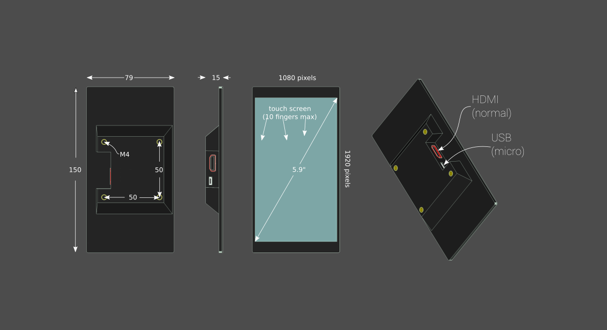

MagnaScreen
===========

..  figure:: ./images/magnascreen_header.png
    :figclass: inline

..  contents:: Table of Contents
    :depth: 2
    :local:

Manga Screen 2 is an LCD screen with a capacitive touch panel and an
HDMI input. For the first Magna Screen, documentation can be found `here </2.0.8/magnascreen.html>`_.

It comes in two versions: Big, 5.9“, 1080p Small, 4.8”, 720p.

If you have a Beaglebone black, a Raspberry Pi or (eventually) an
Arduino Tre or any other embedded or personal computer with a DVI or
HDMI output, you can attach a Manga Screen to it and it will work like a
normal screen.

The resolution is high for such a small screen with 1080x1920 (Full HD)
and the capacitive touch screen driver used is the fabulous Synaptics
S3202.

Here are some tech specs for the big one:

Here is a picture of a prototype in action:

.. image:: ./images/magnascreen2_inaction.jpg

Where to buy
------------

It's currently available for pre-order from `thing-printer.com <https://www.thing-printer.com/product/manga-screen/>`__.

HDMI Cables
~~~~~~~~~~~

The HDMI connector on the screen is a type A (regular) https://en.wikipedia.org/wiki/HDMI#Connectors

USB Cables
~~~~~~~~~~

The USB connector on the screen is of type micro. It can be purchased in just about every Cheap Charley like store.

Getting Started: Raspberry Pi
-----------------------------

Manga Screen Rev B has been tested on Raspberry pi 1, 2 and 3.

Screen rotation
~~~~~~~~~~~~~~~

If you have a Raspberry Pi, you will need to override the settings
manually to get the right rotation and resolution. Look at the config
page for Raspberry Pi, the section called “custom mode” for HDMI:
https://www.raspberrypi.org/documentation/configuration/config-txt.md

Edit the config file:

::

    sudo nano /boot/config.txt

Add this to the end of it:

::

    hdmi_cvt=1080 1920 30 5 0 0 0
    hdmi_group=2
    hdmi_mode=87

    max_framebuffer_width=1920
    max_framebuffer_height=1920

    display_rotate=1

You can also set the timings manually on more modern firmwares:

::

    hdmi_timings=1080 1 100 10 60 1920 1 4 2 4 0 0 0 30 0 79000000 3

Touch panel rotation
~~~~~~~~~~~~~~~~~~~~

The touch panel is rotated 180 degrees compared to the LCD, so you need
to add a rule to udev to rotate it back:

::

    sudo nano /etc/udev/rules.d/99-manga.rules

Add this:

::

    ACTION=="add", ATTRS{name}=="Intelligent Agent AS Manga Screen 2", ENV{LIBINPUT_CALIBRATION_MATRIX}="-1 0 1 0 -1 1" #180

Getting Started: BeagleBone Black
---------------------------------

Works with resolution 1088 x 1920. Note that the x-resolution needs to
be a multiple of 16. The remaining pixels will disappear into the
vertical back porch.

Windows
~~~~~~~

Omxplayer
~~~~~~~~~

Linux
~~~~~

Typically, the touch input is mapped to the main screen. To map the
touch panel to the screen in X, use following command:

::

    xinput map-to-output <device_nr> <output>

To rotate or invert axes in an X based server:

::

    pi@prompt:~ $ DISPLAY=:0 xinput --list
    ⎡ Virtual core pointer                      id=2    [master pointer  (3)]
    ⎜   ↳ Virtual core XTEST pointer                id=4    [slave  pointer  (2)]
    ⎜   ↳ Intelligent Agent AS Manga Screen 2       id=6    [slave  pointer  (2)]
    pi@prompt:~ $ DISPLAY=:0 xinput set-prop 'Intelligent Agent AS Manga Screen 2' 'Evdev Axes Swap' 1
    pi@prompt:~ $ DISPLAY=:0 xinput --set-prop 'Intelligent Agent AS Manga Screen 2' 'Evdev Axis Inversion' 1 0

Adjusting things
----------------

When plugged in the screen should enumerate as a mixed device, both a
touch device and a serial device. The touch device will provide the
touch screen data and the serial device can be used for controlling
stuff on the screen.

To get a list of commands, write

::

    help

Brightness
~~~~~~~~~~

Digitizer rotation
~~~~~~~~~~~~~~~~~~

Uploading EDID
--------------

Attributions
------------

Files
-----

https://www.dropbox.com/sh/q73nyea67a8h55g/AAB-XySmhrjl8W3W276NMPOaa?dl=0
