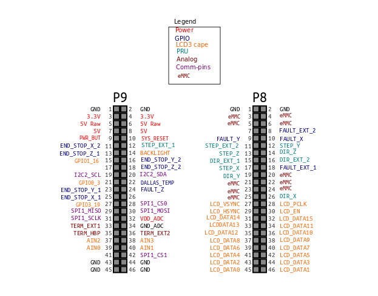
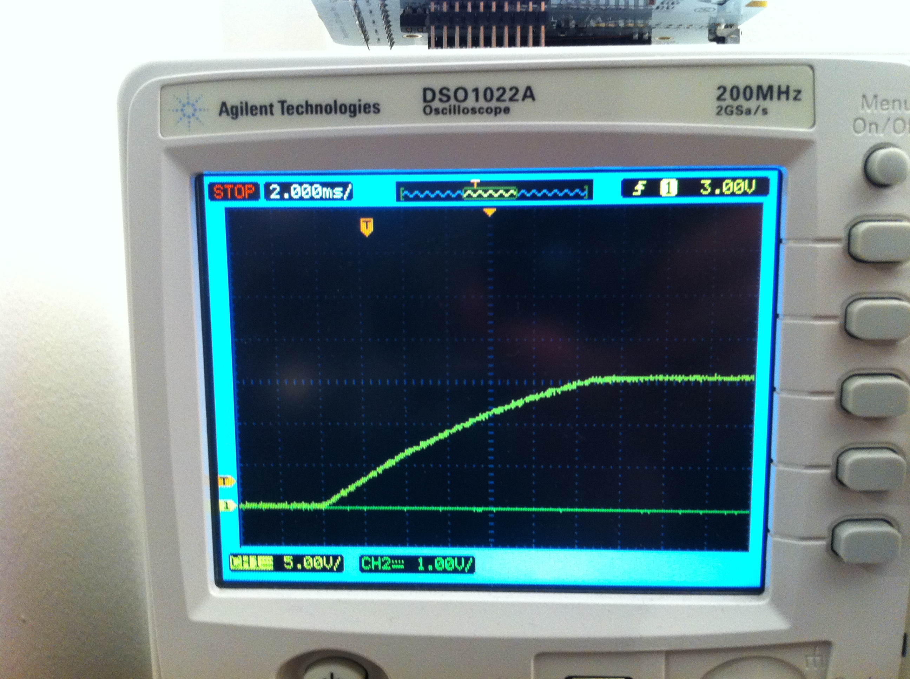

Replicape
=========

..  figure:: ./images/replicape_header.png
    :figclass: inline

..  contents:: Table of Contents
    :depth: 2
    :local:

Replicape is a high end 3D-printer electronics package in the form of a
Cape that can be placed on a BeagleBone Black. It has five high power
stepper motors with cool running MosFets and it has been designed to fit
in small spaces without active cooling.

This page is about the hardware. When you have the hardware mounted,
take a look a the flow diagram to determine what linux distro and host
software you want to use:

..  image:: ./images/replicape_flow_chart.svg

Availability
------------

Replicape can be ordered from the thing-printer web store: http://www.thing-printer.com/product/replicape/

Mounting the Replicape on the BeagleBone
~~~~~~~~~~~~~~~~~~~~~~~~~~~~~~~~~~~~~~~~

This should be pretty straight forward, just make sure the notch in the
cape goes around the Ethernet connector so it makes a.. cape!

How to wire up the board
------------------------

The below image shows how to wire up the board. Notice that pin 1 and
3 on the thermistor connectors are used. This gives the lowest noise
level from the heater cables which usually runs parallel with the
thermistor cables. Up to ten Dallas 1-wire sensors can be connected on
the same bus. If you want to use hall effect sensors, make sure they
can handle 3.3V VCC. BeagleBone does not handle 5V on the inputs and
the board might be destroyed by it.

..  figure:: ./images/replicape_wire_diagram.svg
    :figclass: inline

With the board oriented as in the above image, the wires for the steppers are:  A1, A2, B2, B1

This is different from previous designs, but keeps the wires from crossing on the PCB.

Hardware source files
---------------------

If you want to extend, build or modify Replicape, for the repository: https://bitbucket.org/intelligentagent/replicape

**Replicape Revision A4A**

The schematic and layout has been done in Eagle V6. The changes from Rev A4 are these:

- Re-did the layout so top layer is vertical and bottom is horizontal

-  Swapped B1 and B2 on all the steppers so they do not cross in the layout.

**Routing and noise**

The top layer is mostly vertical traces and the bottom layer is mostly
horizontal. Since the board is only two layers, it's important to try
to keep with this rule so that both layers can have good ground
return. Early designs were troubled by high levels of noise, probably
due to insufficient ground return paths, but also due to bad DC-DC
converter layout.

**Component placement**

All components are placed on the top layer to reduce cost of
manufacturing. There are two fiducials on the top side to aid in pick
and place placement of components.

**Board extensions**

Revision A4A introduced an extension header for adding more extruders.
An extension board would then stack on top of the Replicape. No
extension board has been made as of this writing, but the header is
kept for future expansions. A total of 3 additional extruders should
be possible in addition to three more fans. There is also the MOSI pin
from the last serial to parallel converter to enable programming of
microstepping etc. for the second board. Look at the schematic to
determine the pin-out.

Hardware details
----------------

**Pins on the BeagleBone used by replicape**

Below is a diagram of the pins that have been used on the BeagleBone.

Stepper Motor Controllers
~~~~~~~~~~~~~~~~~~~~~~~~~

Replicape has 5 stepper motor controllers of the type DRV8825. These
can handle up to 2.5A peak current and 1.75 RMS. They are also very
immune to short circuit and over heating compared to the A4988 which
is much used for 3D printer electronics.

High power MOSFETs
~~~~~~~~~~~~~~~~~~

There are also 3 high power MOSFETs for controlling two heater
cartridges and one hot bed. The MOSFETs are of the type AON6758 which
can handle up to 30V and 32A. The MOSFETs are driven by MOSFET drivers
MCP1402 to ensure they are running cool. For a (somewhat dated)
discussion, look here: http://hipstercircuits.com/switching-it-up-using-a-comparator-as-a-level-shifter/
A blue LED is mounted next to each of the MOSFETs to indicate when
they are on or off. All mosfets on the board are controlled with a
single PWM driver of type PCA9685PW.

Low Power MOSFETs
~~~~~~~~~~~~~~~~~

There are 3 low power MOSFETs of the type NIF5002 that can be used for
either fans or LED strips etc. The NIF5002s can handle ~4A each at
12V. There is however a limitation in the DC-DC buck converter
(RT8268) of 2A.

Thermistor inputs
~~~~~~~~~~~~~~~~~

There are 3 inputs for NTC thermistors. Each input has a filter to
suppress high voltage noise spikes coming from the MOSFETs. There is
also a separate pin to ground for shielding the cables of the ADCs.
All the thermistor inputs have low pass filters for removing noise so
normally, there should not be a need for using a shielded cable, but
in particularly noisy environments, it might help. Here is a
discussion of the problem:
http://hipstercircuits.com/noise-on-the-analog-pins-causes-the-adc-sampler-to-go-out-of-whack/

Power management
~~~~~~~~~~~~~~~~

There are two voltage converters on the Replicape rev A2. Both are of
the type DC-DC buck step down converter. One of the converters is
based on MCP16321 and is used to supply the 5V necessary for the
BeagleBone to function properly. Below is an image of the 5V startup
sequence:

..  image:: ./images/5v-startup.jpg

On the Rev A3A design, the switching noise on the buck step down
regulator can get quite high. If the noise is too high the under voltage
protection of the TPS2051 kicks in and disables power on the USB. A
quick-fix to this is to add a large value electrolytic capacitor across
VDD\_5V and ground. Depending on the input voltage (12..24V) anything
from 0.1uF up to 1000uF has been tested and worked with 12V input. A
somewhat more elaborate, but better approach is to add a ~100R resistor
in series with the boost capacitor (C51). This limits the slew rate of
the internal N-MOS and lowers the efficiency with approximately 1%. This
workaround has been done on the A4 revision.

The 12V step down converter is used to supply 12V to the fans/LED
strips.

There is thus no need for any additional power sources beyond a single
12..24V power supply. Below is an image of what the 12V startup
sequence looks like:

..  image:: ./images/12v-startup.jpg

LC power spikes
---------------

This has reportedly been a problem for some stepper motor drivers that
use low ESR capacitors as decoupeling capacitors. See pololus
discussion of the topic: http://www.pololu.com/docs/0J16/all

Replicape has a high quality electrolytic capacitor mounted on the
board to remedy this problem. Here is what the startup looks like. One
of the two power pads were probed:

Stepper motor max speed
~~~~~~~~~~~~~~~~~~~~~~~

Todo: measure this.

Power consumption
~~~~~~~~~~~~~~~~~

The following are some sample values for power use with Replicape mounted:

- Board booting @24V: 80..130mA
- Board running with replicape @24V (5% CPU) 110..120mA
- Board booting @12V 110..190mA
- Board running with replicape @12V (5% CPU) 150..160mA

MOSFET rise and fall times
~~~~~~~~~~~~~~~~~~~~~~~~~~

Power MOSFET with a standard 40 W heater element (Hexagon hot end).

rise time: ~60 ns

Fall time: ~250 ns

Troubleshooting
---------------

Failed to load slot-0
~~~~~~~~~~~~~~~~~~~~~

Depending on which image and kernel you have on your BB, you might see
something like this in dmesg::

    [   63.652815] bone-capemgr bone_capemgr.9: loader: failed to load slot-0 BB-BONE-REPLICAP:00A4 (prio 0)

That means there is no device tree overlay for Replicape in
``/lib/firmware``. You can fix this by installing the replicape-devicetree
package::

    opkg install replicape-devicetree

This should put the right device tree overlay in your /libs/firmware
folder. You need to reboot after that.

Update EEPROM
~~~~~~~~~~~~~

The EEPROM on the Replicape should be updated when it arrives. If not,
here are the instructions on how to update it.

Angstrom
^^^^^^^^

If starting from the Thing image, you need to install nodejs::

    opkg install nodejs

You also need these files::

     wget --no-check-certificate https://bitbucket.org/intelligentagent/replicape/raw/a2b195880014c7c27aabd7c0a8d140c5564007ad/eeprom/replicape_00A4.json
     wget --no-check-certificate https://bitbucket.org/intelligentagent/replicape/raw/a2b195880014c7c27aabd7c0a8d140c5564007ad/eeprom/eeprom.js
     wget --no-check-certificate https://bitbucket.org/intelligentagent/replicape/raw/a2b195880014c7c27aabd7c0a8d140c5564007ad/eeprom/bone.js

Then, make the eeprom content::

    node ./eeprom.js -w replicape_00A4.json

Finally upload the content to the eeprom::

    cat Replicape.eeprom > /sys/bus/i2c/drivers/at24/1-0054/eeprom

Debian
^^^^^^

On the Debian/kamikaze image::

    sudo apt-get install nodejs-legacy
    wget https://bitbucket.org/intelligentagent/replicape/raw/f623a0304134b3effcc427a82de1ebbf7cee82bb/eeprom/replicape_0A4A.json
    wget https://bitbucket.org/intelligentagent/replicape/raw/a2b195880014c7c27aabd7c0a8d140c5564007ad/eeprom/eeprom.js
    wget https://bitbucket.org/intelligentagent/replicape/raw/a2b195880014c7c27aabd7c0a8d140c5564007ad/eeprom/bone.js
    node ./eeprom.js -w replicape_0A4A.json
    cat Replicape.eeprom > /sys/bus/i2c/drivers/at24/2-0054/nvmem/at24-1/nvmem

Please note the address on the I2C bus, it might be 55, 56 or 57 depending on your settings.

Testing Replicape
-----------------

A script is available for testing the board. This is inteded for
manufacturers, but could be useful for end-users as well. To install the
test script do the following. Install the test script package::

    opkg install replicape-test

Use the “testing” config file for Redeem::

    cd /etc/redeem
    ln -s Testing.cfg printer.cfg

Finally, since the boards to test/flash do not have eeprom when plugged
in, it must be enabled through the command line::

    mkdir /media/mmc1
    mount /dev/mmcblk0p1 /media/mmc1/
    echo "optargs=drm.debug=7 capemgr.enable_partno=BB-SGX,BB-BONE-REPLICAP:0A4A consoleblank=0 vt.global_cursor_default=0" > /media/mmc1/uEnv.txt
