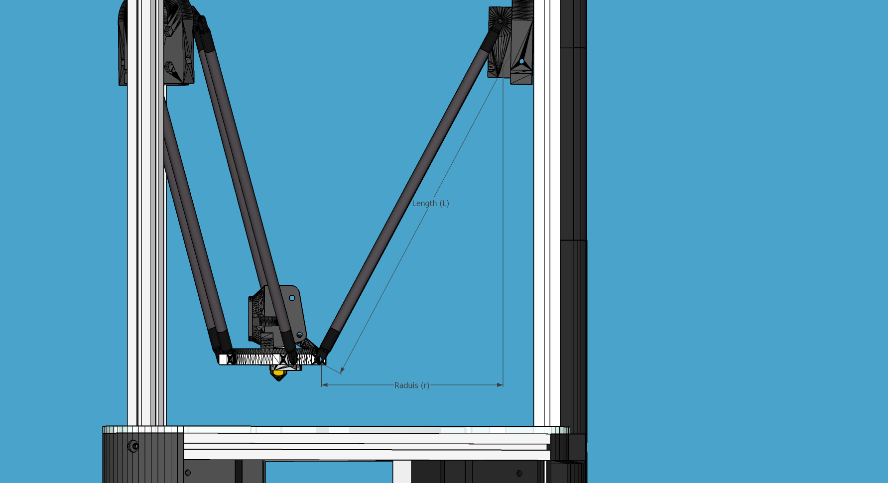
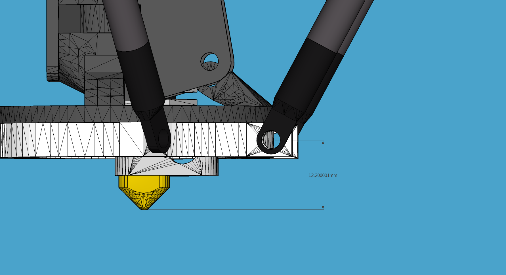

Configuration Settings
======================

-  All units are in SI-units internally in Redeem, but g-codes often expose mm etc.
-  ``default.cfg`` is the bible, all configs must be defined in there.
-  All configurations in default.cfg can be overridden
-  default.cfg and printer.cfg can be changed with updates. ``local.cfg`` can not.
-  Here is the config hierarchy: ``local.cfg`` > ``printer.cfg`` > ``deafult.cfg``

For Redeem, the preferred way to handle configuration is through the web
interface. The web interface is available through
`kamikaze.local <http://kamikaze.local>`__ assuming you have your BeagleBone on the
local network and you are using :doc:`/umikaze/index`.

The config files for redeem are present in the folder ``/etc/redeem/``.
There are three files for setting the configuration. ``default.cfg`` is the
catch-all at the bottom. It will contain all the possible options and
**should not be touched**. Second is ``printer.cfg`` which is a symlink and
specific to a printer. Look in the folder to find one that matches your
printer. If you cannot find one, make it! *Otherwise leave the existing
one as is.* Finally is local.cfg which contains quirks or other
individual settings. The ``local.cfg`` will not be overwritten by new
software updates and can contain stuff like microstepping, stepper
current, offsets as well as any bed compensation matrices etc.

Now normally all settings can come from your specific ``printer.cfg`` config
file, but if no one has made that file, you need to set this stuff up
yourself. Most of the stuff in the config files is in SI units. This is
perhaps different than what other firmwares do, where the focus is on
optimization rather than ease of use. Note that it is important to keep
the section headers in the same case as the examples or ``default.cfg`` as
they are case sensitive.

..  important::

    If you edit a config file incorrectly, redeem will fail to load and
    you will be unable to connect in octoprint. You must use headers, as
    shown in the examples, and consistent spacing/formatting. Also the first
    time you load octoprint you will not have any config files listed in
    settings/redeem, you are supposed to load a blank local.cfg file. You
    shouldn't need to do this again unless you reflash the image. However,
    if you find that your config files suddenly when missing, simply close
    your browser tab and reopen octoprint and they should return.

..  note::

    If you are not writing your own new ``printer.cfg``, keep all your printer
    settings in ``local.cfg`` to avoid getting any setting over-written by a redeem update.

System
------

The system section has only Replicape board revision and log level. For
debugging purposes, set the log level to 10, but keep it at 20 for
normal operations, since logging is very CPU intensive and can cause
delays during prints at high speed. On later versions of Redeem, the
board revision is read from the EEPROM on the Replicape.

::

    [System]

    # CRITICAL=50, # ERROR=40, # WARNING=30,  INFO=20,  DEBUG=10, NOTSET=0
    loglevel =  20

    # If set to True, also log to file.
    log_to_file = True

    # Default file to log to, this can be viewed from octoprint
    logfile = /home/octo/.octoprint/logs/plugin_redeem.log

    # Plugin to load for redeem, comma separated (i.e. HPX2Max,plugin2,plugin3)
    plugins =

    # Machine type is used by M115
    # to identify the machine connected.
    machine_type = Unknown

Plugins
-------

HPX2Max
~~~~~~~

Dual extrusion with the HPX2Max extruder.

::

    [HPX2MaxPlugin]
    # The channel on which the servo is connected. The numbering correspond to the Fan number
    servo_channel = P9_14

    # Extruder 0 angle to set the servo when extruder 0 is selected, in degree
    extruder_0_angle = 20

    # Extruder 1 angle to set the servo when extruder 1 is selected, in degree
    extruder_1_angle = 175

DualServo
~~~~~~~~~

A more general dual extrusion using a servo for switching between hot ends.

::

    [DualServoPlugin]
    # The pin name of where the servo is located
    servo_channel = P9_14
    # minimum pulse length
    pulse_min = 0.01
    pulse_max = 0.02
    angle_min = 0
    angle_max = 180
    extruder_0_angle = 87.5
    extruder_1_angle = 92.5

StartButton
~~~~~~~~~~~

:todo:`TODO`

VCNL4000
~~~~~~~~

:todo:`TODO`

.. _ConfigGeometry:

Geometry
--------

The geometry section contains stuff about the physical layout of your
printer. What the print volume is, what the offset from the end stops
is, whether it's a Normal XY style printer, a Delta printer, an H-belt
type printer or a CoreXY type printer.

It also contains the bed compensation matrix. The bed compensation
matrix is used for compensating any rotation the bed has in relation
to the nozzle. This is typically not something you write yourself, but
instead it is found by probing the bed at different locations by use
of the G-code G29. The G29 command is a macro command, so it only runs
other G-codes and you can override it yourself in the local.cfg file
or in the printer.cfg file if you are a printer manufacturer.

..  note:: Homing works differently on cartesian and delta printers. Please refer to :doc:`/support/howto/homing`.

::

    [Geometry]
    # 0 - Cartesian
    # 1 - H-belt
    # 2 - Core XY
    # 3 - Delta
    axis_config = 0

    # The total length each axis can travel
    #   This affects the homing endstop searching length.
    #   travel_* can be left undefined.
    #   It will be determined by soft_end_stop_min/max_*
    # travel_x = 0.2
    # ...

    # Define the origin in relation to the endstops
    #   offset_* can be left undefined.
    #   It will be determined by home_speed and soft_end_stop_min/max_*
    # offset_x = 0.0
    # ...

    # The identity matrix is the default
    bed_compensation_matrix =
            1.0, 0.0, 0.0,
            0.0, 1.0, 0.0,
            0.0, 0.0, 1.0

Delta
-----

Several variables are needed for defining the geometry of the delta setup.

Terminology:

- Effector is the thing that is in the centre and moves (the one with the hot end)

- The distance from the centre of the effector to where the rods are mounted is the effector offset.

- Carriage is those that move up and down along the columns.

:todo:`TODO`

..  warning::

    I've not figured out what the carriage offset does. You should think
    this was the offset from the carriages to the rods, but I've not
    gotten that top work. Seems broken. Instead, add the carriage offset
    to the effector offset.

For more information on correcting delta calibration, see the :doc:`/support/howto/deltacalibration`.

::

    [Delta]
    # Distance head extends below the effector.
    Hez = 0.0

    # Length of the rod
    L   = 0.135

    # Radius of the columns (distance from column to the center of the build plate)
    r   = 0.144

    # Effector offset (distance between the joints to the rods to the center of the effector)
    Ae  = 0.026
    Be  = 0.026
    Ce  = 0.026

    # Carriage offset (the distance from the column to the carriage's center of the rods' joints)
    A_radial = 0.0
    B_radial = 0.0
    C_radial = 0.0

    # Compensation for positional error of the columns
    # (For details, read: https://github.com/hercek/Marlin/blob/Marlin_v1/calibration.wxm)
    # Positive values move the tower to the right, in the +X direction, tangent to it's radius
    A_tangential = 0.0
    B_tangential = 0.0
    C_tangential = 0.0

Here is a visual depiction of what the length and radius looks like:

Here is what the Hez looks like:

Steppers
--------

This section has the stuff you need for the the steppers:

- the number of steps pr mm for each axis
- the stepper max current
- the microstepping
- acceleration
- max speed
- the option to invert a stepper (so you don't have to rotate the stepper connector),
- the decay mode of the current chopping on the motor drives (see the :ref:`ConfigurationDecay` for more information.

::

    # Stepper e is ext 1, h is ext 2
    [Steppers]

Microstepping
-------------

::

    microstepping_x = 3
    microstepping_y = 3
    microstepping_z = 3
    microstepping_e = 3
    microstepping_h = 3
    microstepping_a = 3
    microstepping_b = 3
    microstepping_c = 3

| 0 - Full step
| 1 - Half step
| 2 - Half step, interpolated to 256
| 3 - Quarter step
| 4 - 16th step
| 5 - Quarter step, interpolated to 256 microsteps
| 6 - 16th step, interpolated to 256 microsteps
| 7 - Quarter step, StealthChop, interpolated to 256 microsteps
| 8 - 16th step, StealthChop, interpolated to 256 microsteps

Current
~~~~~~~

::

    current_x = 0.5
    current_y = 0.5
    current_z = 0.5
    current_e = 0.5
    current_h = 0.5
    current_a = 0.5
    current_b = 0.5
    current_c = 0.5

..  danger::

  Never run the Replicape with the steppers running above 0.5A without cooling.
  Never exceed 1.2A of regular use either - the TMC2100 drivers aren't
  rated higher. If you need more current to drive two motors off the
  same stepper, use slave mode with a second driver (usually H). While it
  means splitting off your wiring of the stepper motors you had going to
  a single driver, but it also means you avoid overheating your drivers.

Ratios
~~~~~~

::

    # steps per mm:
    #   Defined how many stepper full steps needed to move 1mm.
    #   Do not factor in microstepping settings.
    #   For example: If the axis will travel 10mm in one revolution and
    #                angle per step in 1.8deg (200step/rev), steps_pr_mm is 20.
    steps_pr_mm_x = 4.0
    steps_pr_mm_y = 4.0
    steps_pr_mm_z = 50.0
    steps_pr_mm_e = 6.0
    steps_pr_mm_h = 6.0
    steps_pr_mm_a = 6.0
    steps_pr_mm_b = 6.0
    steps_pr_mm_c = 6.0

    backlash_x = 0.0
    backlash_y = 0.0
    backlash_z = 0.0
    backlash_e = 0.0
    backlash_h = 0.0
    backlash_a = 0.0
    backlash_b = 0.0
    backlash_c = 0.0

Enable / Disable
~~~~~~~~~~~~~~~~

::

    # Which steppers are enabled
    in_use_x = True
    in_use_y = True
    in_use_z = True
    in_use_e = True
    in_use_h = True
    in_use_a = False
    in_use_b = False
    in_use_c = False

Direction
~~~~~~~~~

::

    # Set to -1 if axis is inverted
    direction_x =  1
    direction_y =  1
    direction_z =  1
    direction_e =  1
    direction_h =  1
    direction_a =  1
    direction_b =  1
    direction_c =  1

..  _ConfigurationDecay:

Decay
~~~~~

The decay mode affects the way the stepper motor controllers
decays the current. Basically slow decay will give more of a hissing
sound while standing still and fast decay will cause the steppers to
be silent when stationary, but loud when stepping. The microstepping_
settings is :math:`2^x`, so ``microstepping_x = 2`` means :math:`2^2 = 4`.
``3`` then is :math:`2^3 = 8` or one-eighth.

On Replicape Rev B, there are 8 levels of decay. Please consult the `data sheet for TMC2100`__ on the different options.

__ http://www.trinamic.com/_scripts/download.php?file=_articles%2Fproducts%2Fintegrated-circuits%2Ftmc2100%2F_datasheet%2FTMC2100_datasheet.pdf

There are three settings that are controlled on the TMC2100 by the decay mode or rather “chopper configuration”: CFG0,
CFG4 and CFG5 in the TMC2100 data sheet.

**CFG0:** Sets chopper off time (Duration of slow decay phase)

| DIS - 140 Tclk (recommended, most universal choice)
| EN - 236 Tclk (medium)

**CFG4:** Sets chopper hysteresis (Tuning of zero crossing precision)

| DIS: (recommended most universal choice): low hysteresis with ≈4% offull scale current.
| EN: high setting with ≈6% of full scale current at sense resistor.

**CFG5:** Sets chopper blank time ( Duration of blanking of switching spike )

| Blank time (in number of clock cycles)
| DIS - 16 (best performance for StealthChop)
| EN - 24 (recommended, most universal choice)
|
| 0 - DIS\_CFG0 \| DIS\_CFG4 \| DIS\_CFG5
| 1 - DIS\_CFG0 \| DIS\_CFG4 \| EN\_CFG5
| 2 - DIS\_CFG0 \| EN\_CFG4 \| DIS\_CFG5
| 3 - DIS\_CFG0 \| EN\_CFG4 \| EN\_CFG5
| 4 - EN\_CFG0 \| DIS\_CFG4 \| DIS\_CFG5
| 5 - EN\_CFG0 \| DIS\_CFG4 \| EN\_CFG5
| 6 - EN\_CFG0 \| EN\_CFG4 \| DIS\_CFG5
| 7 - EN\_CFG0 \| EN\_CFG4 \| EN\_CFG5

::

    # Set to True if slow decay mode is needed
    slow_decay_x = 0
    slow_decay_y = 0
    slow_decay_z = 0
    slow_decay_e = 0
    slow_decay_h = 0
    slow_decay_a = 0
    slow_decay_b = 0
    slow_decay_c = 0

Slave
~~~~~

::

    # A stepper controller can operate in slave mode,
    # meaning that it will mirror the position of the
    # specified stepper. Typically, H will mirror Y or Z,
    # in the case of the former, write this: slave_y = H.
    slave_x =
    slave_y =
    slave_z =
    slave_e =
    slave_h =
    slave_a =
    slave_b =
    slave_c =

    # Stepper timout
    use_timeout = True
    timeout_seconds = 500

Slave mode
~~~~~~~~~~

If you want to enable slave mode for a stepper driver, meaning it will
mirror the movements of another stepper motor exactly, you need to use
“slave\_y = H” if you want the H-stepper motor to mirror the moves
produced by the Y-stepper motor. Remember to also set the steps\_pr\_mm
to the same value on the the motors mirroring each other, and also the
direction. Most likely you will want the current to be the same as well.

#. Enable the slave stepper driver (in\_use\_h = True)
#. The syntax for selecting which axis is the master and which the slave
   is:
   I want to slave H to Z (H follows everything Z does) then you use
   “slave\_z = H”.
#. If you have any endstops acting on the master axis, then you should
   do the same thing for the slave axis, otherwise it will just keep on
   turning. For example, on a delta with Z1 connected to a bed probe and
   Z2 connected to the tower limit switch: “end\_stop\_Z1\_stops =
   x\_neg, y\_neg, z\_neg, h\_neg” and “end\_stop\_Z2\_stops = z\_pos,
   h\_pos”.

::

    # Stepper e is ext 1, h is ext 2
    [Steppers]
    microstepping_x = 3
    ...

    current_x = 0.5
    ...

    # steps per mm:
    #   Defined how many stepper full steps needed to move 1mm.
    #   Do not factor in microstepping settings.
    #   For example: If the axis will travel 10mm in one revolution and
    #                angle per step in 1.8deg (200step/rev), steps_pr_mm is 20.
    steps_pr_mm_x = 4.0
    ...

    backlash_x = 0.0
    ...

    # Which steppers are enabled
    in_use_x = True
    ...

    # Set to -1 if axis is inverted
    direction_x =  1
    ...

    # Set to True if slow decay mode is needed
    slow_decay_x = 0
    ...

    # A stepper controller can operate in slave mode,
    # meaning that it will mirror the position of the
    # specified stepper. Typically, H will mirror Y or Z,
    # in the case of the former, write this: slave_h = Y.
    slave_x =
    ...

    # Stepper timout
    use_timeout = True
    timeout_seconds = 60

Planner
-------

The acceleration profiles are trapezoidal, i.e. constant acceleration.
One will probably see and hear a difference between Replicape/Redeem and
the simpler 8 bit boards since all path segments are cut down to 0.1 mm
on delta printers regardless of speed and there is also a better
granularity on the stepper ticks, so you will never have quantized steps
either. Further more, all calculations are done with floating point
numbers, giving a better precision on calculations compared to 8 bit
microcontrollers.

This section is concerned with how the path planner caches and paces the
path segments before pushing them to the PRU for processing.

::

    [Planner]

    # size of the path planning cache
    move_cache_size = 1024

    # time to wait for buffer to fill, (ms)
    print_move_buffer_wait = 250

    # if total buffered time gets below (min_buffered_move_time) then wait for (print_move_buffer_wait) before moving again, (ms)
    min_buffered_move_time = 100

    # total buffered move time should not exceed this much (ms)
    max_buffered_move_time = 1000

    # max segment length
    max_length = 0.001

    acceleration_x = 0.5
    ...

    max_jerk_x = 0.01
    ...

    # Max speed for the steppers in m/s
    max_speed_x = 0.2
    ...

    # Max speed for the steppers in m/s
    min_speed_x = 0.005
    ...

    # When true, movements on the E axis (eg, G1, G92) will apply
    # to the active tool (similar to other firmwares).  When false,
    # such movements will only apply to the E axis.
    e_axis_active = True

Cold ends
---------

Replicape has three thermistor inputs and a Dallas one-wire input.
Typically, the thermistor inputs are for high temperatures such as hot
ends and heated beds, and the Dallas one-wire input is used for
monitoring the cold end of a hot end, if you know what I mean... This
section is used to connect a fan to one of the temperature probes, so
for instance the fan on your extruder will start as soon as the
temperature goes above 60 degrees. If you have a Dallas one-wire
temperature probe connected on the board, it will show up as a file-like
device in Linux under /sys/bus/w1/devices/. Find out the full path and
place that in your local.cfg. All Dallas one-wire devices have a unique
code, so yours will be different than what you see here.

::

    [Cold-ends]
    # To use the DS18B20 temp sensors, connect them like this.
    # Enable by setting to True
    connect-ds18b20-0-fan-0 = False
    connect-ds18b20-1-fan-0 = False
    connect-ds18b20-0-fan-1 = False

    # This list is for connecting thermistors to fans,
    # so they are controlled automatically when reaching 60 degrees.
    connect-therm-E-fan-0 = False
    ...
    connect-therm-H-fan-1 = False
    ...

    add-fan-0-to-M106 = False
    ...

    # If you want coolers to
    # have a different 'keep' temp, list it here.
    cooler_0_target_temp = 60

    # If you want the fan-thermistor connections to have a
    # different temperature:
    # therm-e-fan-0-target_temp = 70

Heaters
-------

The heater section controls the PID settings and which temperature
lookup chart to use for the thermistor. If you do not find your
thermistor in the chart, you can find the Steinhart-Hart coefficients
from the `NTC Calculator`__ online tool.

__ http://www.thinksrs.com/downloads/programs/Therm%20Calc/NTCCalibrator/NTCcalculator.htm

Some of the most common thermistor coefficients have already been
implemented though, so you might find it here:

Thermistors
-----------

An example configuration for `E`. The most
important thing to change should be the sensor name matching the
thermistor. The Kp, Ti and Td values will be set by the M303 auto-tune
and the rest of the values are for advanced tuning or special cases.

::

    [Heaters]
    sensor_E = B57560G104F
    pid_Kp_E = 0.1
    pid_Ti_E = 100.0
    pid_Td_E = 0.3
    ok_range_E = 4.0
    max_rise_temp_E = 10.0
    max_fall_temp_E = 10.0
    min_temp_E = 20.0
    max_temp_E = 250.0
    path_adc_E = /sys/bus/iio/devices/iio:device0/in_voltage4_raw
    mosfet_E = 5
    onoff_E = False
    prefix_E = T0
    max_power_E = 1.0

    ...

Steinhart-Heart
~~~~~~~~~~~~~~~

+--------------------+-------------------------------------------------------------------+
| Name               | Comment                                                           |
+====================+===================================================================+
| B57540G0104F000    | EPCOS100K with b= 4066K                                           |
+--------------------+-------------------------------------------------------------------+
| B57560G1104F       | EPCOS100K with b = 4092K                                          |
+--------------------+-------------------------------------------------------------------+
| B57560G104F        | EPCOS100K with b = 4092K (Hexagon)                                |
+--------------------+-------------------------------------------------------------------+
| B57561G0103F000    | EPCOS10K                                                          |
+--------------------+-------------------------------------------------------------------+
| NTCS0603E3104FXT   | Vishay100K                                                        |
+--------------------+-------------------------------------------------------------------+
| 135-104LAG-J01     | Honeywell100K                                                     |
+--------------------+-------------------------------------------------------------------+
| SEMITEC-104GT-2    | Semitec (E3D V6)                                                  |
+--------------------+-------------------------------------------------------------------+
| DYZE               | DYZE hightemp thermistor                                          |
+--------------------+-------------------------------------------------------------------+
| HT100K3950         | RobotDigg.com's 3950-100K thermistor (part number HT100K3950-1)   |
+--------------------+-------------------------------------------------------------------+

PT100 type thermistors
^^^^^^^^^^^^^^^^^^^^^^

+--------------------------+-----------------------------+
| Name                     | Comment                     |
+==========================+=============================+
| E3D-PT100-AMPLIFIER      | E3D PT100                   |
+--------------------------+-----------------------------+
| PT100-GENERIC-PLATINUM   | Ultimaker heated bed etc.   |
+--------------------------+-----------------------------+

Linear v/deg Scale Thermocouple Boards
^^^^^^^^^^^^^^^^^^^^^^^^^^^^^^^^^^^^^^

+----------+-------------------------+
| Name     | Comment                 |
+==========+=========================+
| Tboard   | 0.005 Volts pr degree   |
+----------+-------------------------+

PID autotune
------------

With version 1.2.6 and beyond, the PID autotune algorithm is fairly
stable. To run an auto-tune, use the M-code M303. You should see the
hot-end or heated bed temperature oscillate for a few cycles before
completing. To set temperature, number of oscillations, which hot end to
calibrate etc, try running “M303?” or see the description of the :ref:`M303`.

Endstops
--------

Use this section to specify whether or not you have end stops on the
different axes and how the end stop inputs on the board interacts with
the steppers. The lookup mask is useful for the latter. In the default
setup, the connector marked X1 is connected to the stepper on the
X-axis. For CoreXY and H-bot this is different in that two steppers are
denied movement in one direction, but allowed movement in the other
direction given that one of the end stops has been hit.

Also of interest is the use of two different inputs for a single axis
and direction. Imagine using one input to control the lower end of the
Z-axis and a different input to probe the bed with G20/G30.

If you are not seeing any movement even though no end stop has been hit,
try inverting the end stop.

See also this `blog post and video`__ for a more thorough explanation.

__ http://www.thing-printer.com/end-stop-configuration-for-redeem/

Soft end stops
--------------

Soft end stops can be used to prevent the print head from moving beyond
a specified point. For delta printers this is useful since they cannot
have end stops preventing movement outside the build area.

::

    [Endstops]
    # Which axis should be homed.
    has_x = True
    ...
    # Number of cycles to wait between checking
    # end stops. CPU frequency is 200 MHz
    end_stop_delay_cycles = 1000

    # Invert =
    #   True means endstop is connected as Normally Open (NO) or not connected
    #   False means endstop is connected as Normally Closed (NC)
    invert_X1 = False
    ...
    # If one endstop is hit, which steppers and directions are masked.
    #   The list is comma separated and has format
    #     x_cw = stepper x clockwise (independent of direction_x)
    #     x_ccw = stepper x counter clockwise (independent of direction_x)
    #     x_neg = stepper x negative direction (affected by direction_x)
    #     x_pos = stepper x positive direction (affected by direction_x)
    #   Steppers e and h (and a, b, c for reach) can also be masked.
    #
    #   For a list of steppers to stop, use this format: x_cw, y_ccw
    #   For Simple XYZ bot, the usual practice would be
    #     end_stop_X1_stops = x_neg, end_stop_X2_stops = x_pos, ...
    #   For CoreXY and similar, two steppers should be stopped if an end stop is hit.
    #     similarly for a delta probe should stop x, y and z.
    end_stop_X1_stops =
    ...
    soft_end_stop_min_x = -0.5
    ...
    soft_end_stop_max_x = 0.5
    ...

Multi-extrusion
---------------

Currently Redeem does not yet support tool offsets for dual or
multi-extrusion. These offsets must be configured in the slicer, instead
of in the firmware, for now.

Servos
------

Servos are controlled by two on-chip PWMs and share connector with
Endstop X2 and Y2.

-  Servo 0 is on pin P9\_14
-  Servo 1 is on pin P9\_16

Use :ref:`m280` to set
the servo position. Note that multiple servos can be present, the init
script will continue to initialize servos as long as there are higher
indexes, so keep the indexes increasing for multiple servos.

::

    [Servos]
    # For Rev B, servo is either P9_14 or P9_16.
    # Not enabled for now, just kept here for reference.
    # Angle init is the angle the servo is set to when redeem starts.
    # pulse min and max is the pulse with for min and max position, as always in SI unit Seconds.
    # So 0.001 is 1 ms.
    # Angle min and max is what angles those pulses correspond to.
    servo_0_enable = False
    servo_0_channel = P9_14
    servo_0_angle_init = 90
    servo_0_angle_min = -90
    servo_0_angle_max = 90
    servo_0_pulse_min = 0.001
    servo_0_pulse_max = 0.002

Z-Probe
-------

Before attempting the configuration of a Z probe make sure your printer
is moving in the right direction and that your hard endstops and your
soft endstops are configured correctly please refer to the endstop
section.

| The standard configs for Z-probe should work for most. The real
  difficulty lies in making the macro for the whole probing procedure.
  The offsets are the distance from the probe point to the nozzle. Here
  are the standard values:

::

    [Probe]
    length = 0.01
    speed = 0.05
    accel = 0.1
    offset_x = 0.0
    offset_y = 0.0

For more information, check out the :doc:`/support/howto/zprobes` page.

Rotary-encoders
---------------

..  warning::

    work in progress.

::

    [Rotary-encoders]
    enable-e = False
    event-e = /dev/input/event1
    cpr-e = -360
    diameter-e = 0.003

Filament-Sensors
----------------

.. warning::

    work in progress. See the blog post `Filament Sensor <http://www.thing-printer.com/filament-sensor-3d-printer-replicape/>`_.

::

    [Filament-sensors]
    # If the error is > 1 cm, sound the alarm
    alarm-level-e = 0.01

Watchdog
--------

The watchdog is a time-out alarm that will kick in if the
/dev/watchdog file is not written at least once pr. minute. This is a
safety issue that will cause the BeagleBone to issue a hard reset if
the Redeem daemon were to enter a faulty state and not be able to
regulate the heater elements. For the watchdog to start, it requires
the watchdog to be resettable, with the proper kernel command line ``omap\_wdt.nowayout=0``.

This should be left on at all time as a safety precauchion, but can be
disabled for development purposes. This is not the same as the stepper
watchdog which only disables the steppers.

::

    [Watchdog]
    enable_watchdog = True

Macros
------

The macro-section contains macros. Duh. Right now, only G29, G31 and G32
has macro definitions and it's basically a set of other G-codes. To make
a new macro, you need to also define the actual g-code file for it. That
is beyond this wiki, but look at G29 in the repository, for instance:
`2 <https://bitbucket.org/intelligentagent/redeem/src/73c21486b1e294570a125e9fac6c9cef9b4f273b/redeem/gcodes/G29.py?at=develop>`__

..  note::

    Each line in macros section needs to be spaced the same or you may
    not be able to connect in octoprint. Most Inductive sensors don't need
    probe type defined to work. To simply turn an inductive sensor on and
    off change the example macro with the g31/g32 macro's i have listed
    here. The g32 may need adjusting to match your z1 endstop settings.
    Undock turns probe on, Dock turns it off. Check your Macro and setup
    carefully, in the g29 example, at the end of each probe point it docks
    your probe then homes z before the start of the next point, which in
    some printers can crash your probe into the bed possibly causing damage.

If you find that your probe routine is probing the air, your z
axis is most likely moving in the wrong direction for the probing
to work. It seems redeem only probes in one direction and this
can't be changed in the probing settings. So, You will need to
swap your z direction, in the [steppers] section using
direction\_z = -1 or direction\_z = +1, then confirm your z
stops/homing, ect work make corrections as required. You will also
most likely need to change under [Geometry] travel\_z direction.
This should trick the probe into moving in the correct direction.

**G31**::

    M574 Z2  ; Probe up (Dock sled)

**G32**::

    M574 Z2 z_ccw, h_ccw  ; Probe down (Undock sled)

::

    [Macros]
    G29 =
        M561                ; Reset the bed level matrix
        M558 P0             ; Set probe type to Servo with switch
        M557 P0 X10 Y20     ; Set probe point 0
        M557 P1 X10 Y180    ; Set probe point 1
        M557 P2 X180 Y100   ; Set probe point 2
        G28 X0 Y0           ; Home X Y

        G28 Z0              ; Home Z
        G0 Z12              ; Move Z up to allow space for probe
        G32                 ; Undock probe
        G92 Z0              ; Reset Z height to 0
        G30 P0 S            ; Probe point 0
        G0 Z0               ; Move the Z up
        G31                 ; Dock probe

        G28 Z0              ; Home Z
        G0 Z12              ; Move Z up to allow space for probe
        G32                 ; Undock probe
        G92 Z0              ; Reset Z height to 0
        G30 P1 S            ; Probe point 1
        G0 Z0               ; Move the Z up
        G31                 ; Dock probe

        G28 Z0              ; Home Z
        G0 Z12              ; Move Z up to allow space for probe
        G32                 ; Undock probe
        G92 Z0              ; Reset Z height to 0
        G30 P2 S            ; Probe point 2
        G0 Z0               ; Move the Z up
        G31                 ; Dock probe

        G28 X0 Y0           ; Home X Y

        M561 U; (RFS) Update the matrix based on probe data
        M561 S; Show the current matrix
        M500; (RFS) Save data

    G31 =
        M280 P0 S320 F3000  ; Probe up (Dock sled)

    G32 =
        M280 P0 S-60 F3000  ; Probe down (Undock sled)

..  important::

    There is a configuration page where you can choose what ``printer.cfg`` links to and edit ``local.cfg``.
