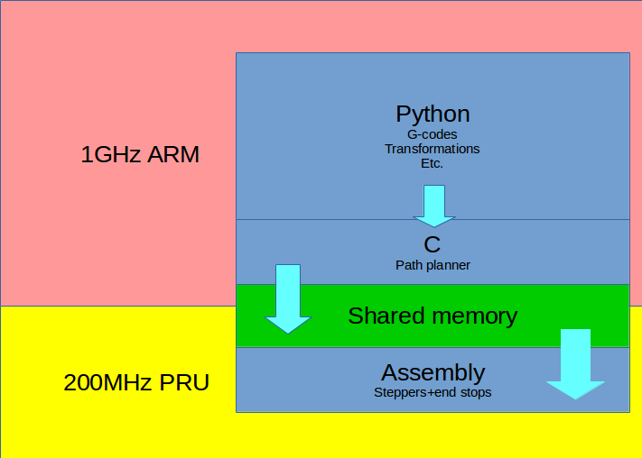

Redeem
======

Redeem is the Replicape firmware; it is a daemon process that chews G-codes
and spits out coordinates. The software can be found in the redeem repository:
https://bitbucket.org/intelligentagent/redeem

Architecture
------------

Most of Redeem is written in Python, with the exception of the most
heavily used gcode commands: G0/G1. These have been optimized in C.
This allows rapid development of new features which are infrequently
run -- such as bed leveling -- using python's scripting language capabilities
of garbage collection and extensive libraries

Manual Installation
-------------------

The recommended method for installation is to use the Umikaze image which includes
operating system, redeem, octoprint and all the dependencies needed.

If you'd rather install the Redeem firmware on your own operating system, you can use
the Debian repository packages for Replicape and Toggle::

    wget -O - http://kamikaze.thing-printer.com/apt/public.gpg | apt-key add -
    echo "deb http://kamikaze.thing-printer.com/apt ./" >> /etc/apt/sources.list
    apt-get update

The Kernel in the current image is the 4.1 LTS branch, and it has PRU support.

Efforts are ongoing to try and use the 4.4 LTS branch for the new Wireless version of the BeagleBoneBlack.

Updating
--------

The octoprint\_redeem plugin should provide a prompt when there is a
redeem update available, and the wizard should work in almost all cases.
If it doesn't, or if you prefer knowing the gritty details of how to do
this by hand, here are the manual instructions:

login as root and execute these commands:

::

    cd /usr/src/redeem
    git pull
    python setup.py clean install
    cp configs/* /etc/redeem
    systemctl restart redeem

Develop branch
--------------

If your printer suffers from problems that are being addressed or if you
want to help test the next version of redeem, you need to switch your
installation to the develop branch of Redeem. **Beware: there be bugs
and dragons in this code!**

To do so, follow these instructions:

::

    cd /usr/src
    rm -r redeem
    git clone https://bitbucket.org/intelligentagent/redeem.git
    cd redeem
    git checkout develop
    make clean install
    systemctl restart redeem