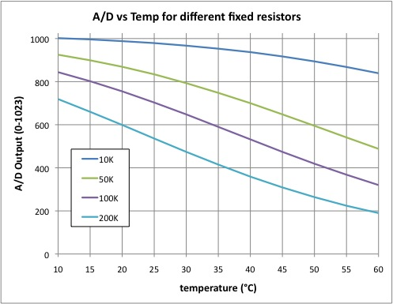

Tech Specs
==========

.. role:: todo

.. _ReplicapeSteppers:

Steppers
--------

There are five `TMC2100`__ Stepper Motor Controllers (SMDs) on Replicape which support
bipolar and hybrid varieties.

With the board oriented as in the above image, the wires for the steppers are:

**1, 2, 3, 4 = OA2, OA1, OB1, OB2**

.. note:: This pin out is different from Rev B2.

The peak current is rated at 2.5 A, with an RMS current pr phase of 1.2 A.

The Replicape is designed to operate without active cooling but the TMC2100 can get quite
hot if peak current is sustained, especially with several stepper motors operating simultaneously.
The SMDs have over temperature protection, so if a skipped steps occurs, it might be due
to over heating. To address this, there are exposed areas directly under the stepper drivers
where heat sinks can be mounted. Or consider adding active cooling to lead the air flow away
from the gap between the BeagleBone and the cape.

__  http://www.trinamic.com/products/integrated-circuits/stepper-power-driver/tmc2100

While the TMC2100 stepper drivers are designed to be very quiet, high coil
resistance prevents reaching the current limit causing the steppers to give off a high pitched sound.

If you are experiencing this, you might want to experiment with the "stealth mode"
which will silence all steppers. See the :ref:`microstepping configuration <ConfigStepperMicrostepping>` section
for more information. Stealth mode might make the steppers somewhat less powerful, but
should work for most printers.

To calculate if the current limit is reached or not, you can calculate the maximum
coil resistance for a given input voltage. If the input voltage is 12V and you want
to run your steppers on 1A current limit, the maximum coil resistance can be 12 ohm.

..  warning:: Some smaller stepper motors are known to produce a high
    pitch noise and get very warm even with a low current setting. They will
    appear to work, but they may very well burn do to the large heat being
    produced.

.. _ReplicapeHeaters:

Heaters
-------

Hot end and heat bed connections use Molex brand screw terminal connectors for easy connection and easy removal.

In addition to the ruggedness, the bed connector has double connections for redundancy
if one wire were to come loose and for handling the larger power load.

All the heaters are controlled with Pulse Width Modulation (PWM)
using `SIRA34DP-T1-GE3`__ power MOSFeTs with a maximum voltage of
30V and a maximum current 40A. This is an update from the Rev B2 which
used AON6758 that were only rated to 32A.

__ http://media.digikey.com/pdf/Data%20Sheets/Vishay%20Siliconix%20PDFs/sira34dp.pdf

For a 12V Power Supply Unit (PSU), this means that the maximum power that
can be used on the heated bed is 32 A x 12 V = 384 W. :todo:`Please remember that there is a 20 A
fuse preventing such a large power use on the heated bed. The 20 A fuse is installed to keep
the traces on the PCB from over heating.`

Thermistors
-----------

The thermistor inputs on Replicape have been designed for 100 K NTC thermistors which are
most commonly used for desktop 3D-printers.  10K thermistors can also be used, however the
voltage divider setup makes the 100 K thermistors more ideal since they provide more variation
at typical operating temperatures.

Thermocouple
------------

A thermocouple is not supported out of the box and requires some
extra care in order to work. Most importantly is to use a `voltage
divider <https://en.wikipedia.org/wiki/Voltage_divider>`__ on the signal
so it is converted to the 1.8V value that the analog input on the BeagleBone
can handle.

Additionally, the input needs to be connected to AIN0..AIN3 (pins P9_37...P9_40).

The analog inputs used needs to be enabled by a device tree overlay, ideally by editing the `current DTO`__.

__ https://github.com/eliasbakken/bb.org-overlays

Finally, the :todo:`software needs to be hacked` to make use of the new analog input and conversion.

Inductive sensors
-----------------

:todo:`TODO`

Inductive sensors is typically mounted on the end stop marked Z2.

If you have an NPN (sinking) sensor, you can mount it directly on there.

A PNP (sourcing) type will need an added pull-down
resistor externally between the signal and ground on the sensor. The
value is not important, as long as it can comfortably pull a 4.7K
resistor low; 1K should be fine.

DS18B20 temperature sensors
---------------------------

:todo:`TODO`

The connector marked Dallas W1 can be used for connecting temperature
sensors of the type DS18B20. These are relatively low temperature
sensors that can handle up to 125 degrees Celsius and are typically used
for monitoring the cold end of the extruder which should never reach
more than around 60 degrees when printing with PLA. The great thing
about using a cold end monitor is that the temperature measurements can
be used to regulate the fan on the extruder. That way, the noise level
can be lowered further than when using the thermistor as a trigger for
enabling the extruder fan.

Fans
----

Fans (or any other devices) can be PWM controlled by the four AO7400, which
have a maximum voltage of 30 V and a current rating of 1.7A.

Switches as end stops
---------------------

:todo:`TODO`

All the end stops have 4.7K (47K on Rev B3) pull-up resistors on the
signal lines. Therefore, the best way to connect switches is between the
signal and ground pins on the connectors. If the switches have can be
connected as normally closed (NC), that is preferable since it will act
as a pressed in switch if a cable has been destroyed or removed.

The signals on the end stops as as follows:
| pin 1, square, signal (yellow wire in Fritzing diagram above)
| pin 2, round, GND (black wire in Fritzing diagram above)
| pin 3, round, VCC (red wire in Fritzing diagram above)(5V)

Power
-----

Replicape is powered through a single 12 to 24 V power supply. This
powers the BeagleBone as well, through a 5V step down converter. It also
supplies 12V for fans and the inductive sensor. If the USB device
connector is used, no power is drawn through the connector.

..  note::
    If you power the BBB but not the the Replicape, the BBB will not be able
    to properly communicate with it, and you will get an error such as
    ``kamikaze redeem[675]: Error accessing 0x70: Check your I2C address`` or
    ``spi.open(2, 1) IOError: [Errno 2] No such file or directory``.
