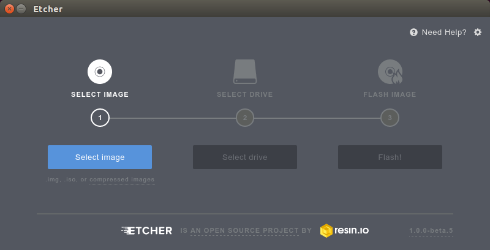

Image Burn
==========

Once you have the Umikaze image for the BeagleBone Black downloaded to your computer, you can transfer it to a microSD card.

.. note:: The latest version of Umikaze requires at least 4GB

Several programs are available to burn the image on the microSD card. `Etcher <http://www.etcher.io/>`_ is recommended.

Initial
-------

Linux
~~~~~

For Linux, make sure you make the app executable and start it as root:

::

    cd ~/Downloads
    chmod +x Etcher-linux-x64.AppImage
    sudo ./Etcher-linux-x64.AppImage

Windows
~~~~~~~

Run the program installer and launch the application.

OS X
~~~~

Open the DMG to drag the app into the application folder. Launch the application.

Burning
-------

| Follow the instructions from the app, briefly:
| 1) Hit “select image” and find the image you previously downloaded
  called " Umikaze-2.1.1.img.xz".
| 2) Insert a 4GB micro SD card (or larger) in your SD card reader slot.
  The card should be detected by the app.
| 3) Hit flash, and wait for it to finish.
| Elias also made a quick video on how to do this procedure:
| {{#evt: service=youtube
  \|id=\ https://www.youtube.com/watch?v=23Id20_8hWs \|alignment=center
  }}