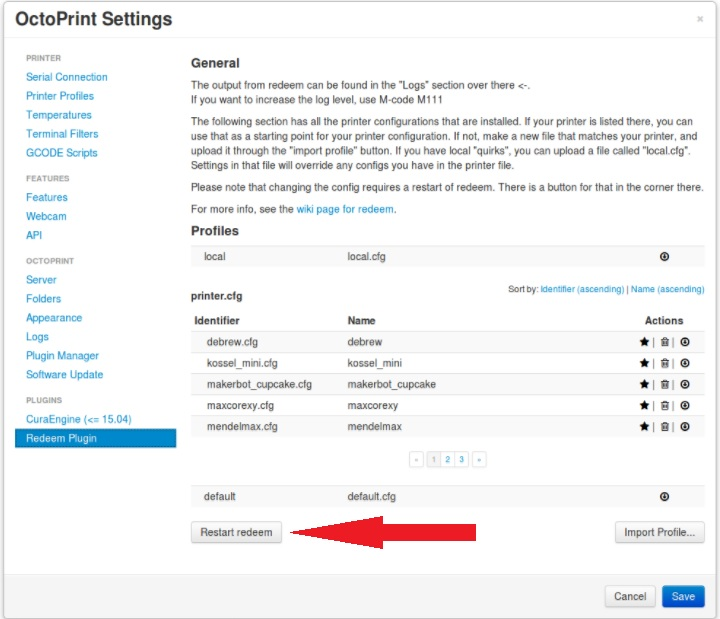

Cartesian Printers
==================

***This is a work in progress, so bare with me...***

Welcome to the *Setting up Replicape for Cartesian Printers* How-To!!

First off, if this is your first printer, or maybe the first printer
you've built yourself, please just take your time and don't frustrate
yourself. If you thought you were going to be printing on the first day
or even the first week, I hate to break the news, but there is a
learning curve involved. Try to have fun, and don't hesitate to check in
over at:
`Slack <https://www.thing-printer.com/wp-login.php?action=slack-invitation>`__
and
`Google+ <https://plus.google.com/communities/104577360369030938514>`__
if you need some real-time help.

-  I'm hoping you have figured out how to wire your steppers, end stops,
   fans, heaters, etc... I also hope you know your way around Cartesian
   space... from this point on, just remember that on your Cartesian
   printer, the `front left <front_left>`__ corner of your build plate
   is X 'zero', and Y 'zero' (0,0)... and when the tip of your hot end
   is touching your build plate your Z axis is at 'zero'...

-  When you first turn on your printer, the system is going to think
   it's sitting at X 'zero', Y 'zero', Z 'zero' until it homes to it's
   endstops, so until we have the correct configuration, let's only make
   careful moves with the software.

-  Setting up your printer will require accuracy, so if you don't have a
   digital caliper on hand, I suggest you stop right now and grab one.

OK! So if your printer is wired up, and you have the software flashed,
let's get started!

Configurations
--------------

Let's open Octoprint and check out the Profile Configurations which are
located in These guys are what tells Redeem (the software) everything it
needs to know about your printer. At the bottom you'll see
*Default.cfg*... Click on the little eyeball and check out all of the
commands in that file. This configuration contains all of the necessary
commands that tells the software the size of the printer, how much power
to send to your steppers, how fast it can move, and how slow, just to
name a few... Ok, close that window... above *Default.cfg*, you'll see
*Printer.cfg*... these particular configurations are tweaked for
specific printers, and whatever is written to this configuration will
override the commands within the *Default.cfg*... if you have a name
brand printer or a similar clone, you can choose the configuration that
matches your printer by clicking the star symbol and make it your
default Printer Profile. This could get you to third base with setting
up your printer! You may have noticed that you can't edit the commands
in your *Default.cfg* and *Printer.cfg*... that's where the *Local.cfg*
up top comes in. What? There's nothing in that profile? You're right!
This is where you get to add commands to the configuration... and this
configuration overrides the *Printer.cfg*, and the *Default.cfg*, so now
I hope you're seeing the “hierarchy” of the configurations...
*Local.cfg* > *Printer.cfg* > *Default.cfg*...

As I noted before, if your printer is a name brand or clone of a certain
printer brand, you can go ahead and make one of the *Printer.cfg*
profiles your default by clicking the star on the particular profile you
want to use.

**Whenever you make any changes to Redeem, you will need to restart
Redeem by clicking the *Restart Redeem* button below the profiles or
from the *System* tab at the top of Octoprint. Your changes will not
take effect until you do so.**

Using Printer.cfg
-----------------

If you're planning to use a *Printer.cfg* profile as your default, you
can restart Redeem as mentioned above and move on to the *Checking your
configuration* section to see if the configuration works as it should.
However, I suggest reading through the following section to get a better
understanding of the bits and pieces of the configuration. Chances are,
you'll need to make adjustments to the entries explained in the next
section anyways.

Setting up your Local.cfg
-------------------------

So now that we've discussed the three levels of configurations, let's
get started with editing your *Local.cfg*! Setting up your *Local.cfg*
can get pretty complicated, but for now, we're just going to get your
printer moving normally, homing correctly, and stopping where it's
supposed to... once you've got your feet wet, and maybe waste deep,
you'll eventually need to dive into some deeper water to get your
printer tweaked for maximum performance... I'll tell you where to go at
the end of this How-To.

Copy and paste the following commands within the text block to your
*local.cfg*.

::

    [Steppers] 
    # steps per mm:
    #   Defined how many stepper full steps needed to move 1mm.
    #   Do not factor in microstepping settings.
    #   For example: If the axis will travel 10mm in one revolution and
    #                angle per step in 1.8deg (200step/rev), steps_pr_mm is 20.
    steps_pr_mm_x = 4.0
    steps_pr_mm_y = 4.0
    steps_pr_mm_z = 50.0
    steps_pr_mm_e = 6.0
    steps_pr_mm_h = 6.0

    # Which steppers are enabled
    in_use_x = True
    in_use_y = True
    in_use_z = True
    in_use_e = True
    in_use_h = True

    # Set to -1 if axis is inverted
    direction_x =  1
    direction_y =  1
    direction_z =  1
    direction_e =  1
    direction_h =  1

    # A stepper controller can operate in slave mode,
    # meaning that it will mirror the position of the
    # specified stepper. Typically, H will mirror Y or Z,
    # in the case of the former, write this: slave_y = H.
    slave_x =
    slave_y =
    slave_z =
    slave_e =
    slave_h =

    [Endstops]
    has_x = True
    has_y = True
    has_z = True
    invert_X1 = False
    invert_Y1 = False
    invert_Z1 = False
    end_stop_X1_stops =
    end_stop_Y1_stops =
    end_stop_Z1_stops =

    # Example: end_stop_X1_stops = x_neg ``\ *``or``*\ `` x_pos ...
    [Homing]
    home_x = 0.0
    home_y = 0.0
    home_z = 0.0
    home_e = 0.0
    home_h = 0.0

Checking your Configuration
---------------------------

Endstops
~~~~~~~~

The first thing we need to do is make sure your endstops are working
correctly... to do this, all you need to do is go into Octoprint and
open the Terminal. When you press in your endstop switches, you should
see a message in the terminal that displays which end stop was hit. If
you're not seeing this message, then you need to go back to your
*Local.cfg* and scroll down to [Endstops]... change the *invert* command
for that stepper from *False* to *True*... Restart Redeem, and reopen
the Terminal. Physically press the endstop switch again and see if the
message appears. If not, check that you have wired the switch correctly.

Stepper Direction
~~~~~~~~~~~~~~~~~

**\* If you have two steppers on one axis, then you will need to either
use a Y-cable or set up *H-axis* as the slave for that axis... my
suggestion is to set up one stepper at a time. Once you have one stepper
working correctly, you can unplug it from the board and connect the
slave stepper to the *H-axis*...**

Open your Terminal and enter *M18*... Physically move your XY gantry to
the center of the printer... Once it's positioned in the center, enter
*G92 X* in the Terminal... this will zero your X-axis... Now enter *G1
X20 F300* into the terminal... Your X-axis should move to the right...
if it doesn't, you need to open your *Local.cfg* and scroll to the
[Steppers] section... Change “direction\_x = 1” to “direction\_x =
-1”... Restart Redeem and try these steps again. Afterwards, if your
X-axis is moving to the right as it should, you can move on to the
Y-axis...

Use the same method to check your Y-axis... Center the gantry... enter
*G92 Y* to zero the axis, and then enter *G1 Y20 F300* into the
terminal... it should move to the rear... if not, change *direction\_y =
1* to *direction\_y = -1*... Restart Redeem... check it again...

You may need to physically screw your Z-axis to somewhere around midway,
so enter *M18* into your terminal and turn the screw until it's close to
midway.. Once it's there, enter *G92 Z* to zero your Z-axis, and then
enter *G1 Z20 F300*... if your nozzle doesn't move away from your bed,
then you need to change *direction\_z = 1* to *direction\_z = -1* and
try again the same way you did with X and Y...

**If for some reason, your stepper doesn't move when you give the *G1*
commands up above, you may need to invert the endstop for that specific
axis.**
